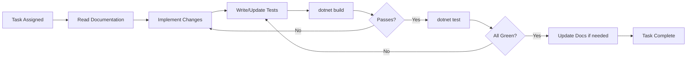

# AGENTS.md — CleanArchReference

> **Profile:** Senior Fullstack Engineer (.NET 9 + React 19)
> **Purpose:** Projeto referência de estudo — Clean Architecture · Design Patterns · Boas Práticas
> **Architecture:** Clean Architecture · MediatR CQRS · EF Core · PostgreSQL 16
> **Frontend:** React 19 · Vite · Ant Design 5 · TanStack Query 5 · Axios
> **Infrastructure:** Docker Compose · Redis · Meilisearch
> **Testing:** xUnit · Moq · FluentAssertions

---

## Rule Hierarchy

When processing any task, consult sources in this order:

1. `AGENTS.md` — This file (master rules and behavior)
2. `CLAUDE.md` — Tool-specific guidance
3. `.opencode.json` — OpenCode context configuration
4. `docs/INDEX.md` — Master documentation navigation
5. `docs/architecture.md` — Architecture and C4 diagrams
6. `docs/backend/rules.md` — Backend conventions
7. `docs/frontend/rules.md` — Frontend conventions

---

## Core Philosophy

> Este projeto é um **material de estudo** sobre Clean Architecture, CQRS, Design Patterns e boas práticas.
> O domínio fiscal (obrigações acessórias) é o pano de fundo — o foco está na **arquitetura e nos padrões**.

### Clean Architecture (7-project .NET solution)

```
Api → Application → Domain
Api → IoC → Infrastructure.Data → Domain
```

- **Domain** — Zero dependencies. Commands, Handlers, Validators, Models, Repository interfaces.
- **Application** — AppServices (thin facades), ViewModels, AutoMapper profiles.
- **Infrastructure.Data** — EF Core DbContext, Entity mappings, Repository implementations.
- **Infrastructure.CrossCutting.IoC** — DI composition root (ProjectBootstrapper).
- **Api** — Endpoints (Minimal API), Middleware, Program.cs.
- **Shared** — ResponseData envelope, shared types.

### Request Flow (mandatory chain)

```
Endpoint → AppService → IMediatrService → ValidationBehavior → CommandHandler → Repository → IUnitOfWork
```

### Frontend Feature-Based Architecture

```
Page → Hook (TanStack Query) → Service → api/axios → API
```

---

## Non-Negotiable Rules

1. **MUST** follow the command chain — Endpoint/Controller never calls Repository directly.
2. **MUST** keep Domain pure — no references to Application, Infrastructure, or HTTP.
3. **MUST** use `IUnitOfWork.CompleteAsync()` in write handlers only (repositories never call SaveChanges).
4. **MUST** place Commands, Handlers, Validators, and Repository interfaces in Domain.
5. **MUST** place ViewModels, AutoMapper Profiles, and AppServices in Application.
6. **MUST** have FluentValidation validators for every write Command (Create, Update, Delete).
7. **MUST** use MediatR `INotification` for side effects (cache invalidation, search indexing).
8. **MUST NOT** add try/catch or `if` validation logic in endpoints/controllers — use ExceptionMiddleware and FluentValidation.
9. **MUST** run `dotnet test` and `dotnet build` before marking any task complete.
10. **MUST** write tests for every new Handler (happy path + error cases).
11. **MUST** document every public API endpoint and domain service.

---

## Development Workflow



### Commands

```bash
# Build
dotnet build src/api/CleanArchReference.Api/CleanArchReference.Api.csproj

# Test
dotnet test src/api/CleanArchReference.Tests/CleanArchReference.Tests.csproj

# Run with Docker
docker compose up --build -d

# Frontend dev
cd src/web && npm run dev

# Add migration
cd src/api && dotnet ef migrations add <Name> --project CleanArchReference.Infrastructure.Data --startup-project CleanArchReference.Api
```

---

## Key File Mapping

| File | Purpose |
|---|---|---|
| `src/api/CleanArchReference.Api/Program.cs` | Application entry point |
| `src/api/CleanArchReference.Api/Middleware/ExceptionMiddleware.cs` | Global exception handler |
| `src/api/CleanArchReference.Infrastructure.CrossCutting.IoC/ProjectBootstrapper.cs` | DI composition root |
| `src/api/CleanArchReference.Infrastructure.Data/Context/AppDbContext.cs` | EF Core DbContext |
| `src/api/CleanArchReference.Infrastructure.Data/Seed/DatabaseSeeder.cs` | Demo data seeder |
| `src/api/CleanArchReference.Domain/Obrigacoes/Services/TributaryRulesEngine.cs` | Fiscal rules engine (Strategy Pattern) |
| `docker-compose.yml` | Infrastructure orchestration |

---

## Stacks

### Backend
- .NET 9, ASP.NET Core, EF Core 9, Npgsql
- MediatR 12, FluentValidation 11, AutoMapper 13
- Redis (StackExchange), Meilisearch .NET client
- xUnit, Moq, FluentAssertions

### Frontend
- React 19, Vite 6, TypeScript 5
- Ant Design 5, TanStack Query 5, Axios
- Dayjs, React Router

### Infrastructure
- PostgreSQL 16 Alpine
- Redis 7 Alpine
- Meilisearch 1.9
- Docker Compose, Nginx (SPA serve + proxy)
