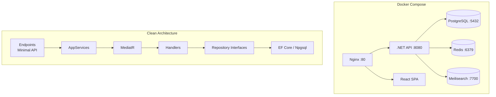

# CLAUDE.md — case_e-Auditoria

## Mandatory Reading Order

Before starting any task, read files in this order:

1. `AGENTS.md` — Master agent rules and persona
2. `docs/INDEX.md` — Documentation index
3. `docs/architecture.md` — Architecture overview
4. `docs/backend/rules.md` — Backend conventions
5. `docs/frontend/rules.md` — Frontend conventions

---

## Project Overview

**Painel de Obrigações Acessórias** — A fiscal obligations management panel for Brazilian accounting firms. Manages companies (CNPJ + tax regime), generates monthly/annual accessory obligations automatically, tracks delivery status, and provides deadline alerts.

### Tech Stack

| Layer | Technology |
|---|---|
| Backend | .NET 9, ASP.NET Core, EF Core 9, Npgsql |
| CQRS | MediatR 12, FluentValidation 11, AutoMapper 13 |
| Database | PostgreSQL 16 |
| Cache | Redis 7 (StackExchange) |
| Search | Meilisearch 1.9 |
| Frontend | React 19, Vite 6, TypeScript 5 |
| UI Kit | Ant Design 5 |
| State | TanStack Query 5, Axios |
| Infrastructure | Docker Compose, Nginx |
| Tests | xUnit, Moq, FluentAssertions |

---

## Commands

### Backend

```bash
# Build
dotnet build src/api/PainelObrigacoes.Api/PainelObrigacoes.Api.csproj

# Run tests
dotnet test src/api/PainelObrigacoes.Tests/PainelObrigacoes.Tests.csproj

# Add EF migration
cd src/api && dotnet ef migrations add <Name> --project PainelObrigacoes.Infrastructure.Data --startup-project PainelObrigacoes.Api

# Apply migration (local PG required)
cd src/api && dotnet ef database update --project PainelObrigacoes.Infrastructure.Data --startup-project PainelObrigacoes.Api
```

### Frontend

```bash
# Dev server
cd src/web && npm run dev

# Build
cd src/web && npm run build

# Lint
cd src/web && npm run lint
```

### Docker

```bash
# Full stack
docker compose up --build -d

# Just database
docker compose up -d db

# Logs
docker compose logs -f api web
```

---

## Key Files

| File | Path |
|---|---|
| Solution | `case_e-Auditoria.slnx` |
| Entry Point | `src/api/PainelObrigacoes.Api/Program.cs` |
| DI Setup | `src/api/PainelObrigacoes.Infrastructure.CrossCutting.IoC/ProjectBootstrapper.cs` |
| DbContext | `src/api/PainelObrigacoes.Infrastructure.Data/Context/AppDbContext.cs` |
| Seed Data | `src/api/PainelObrigacoes.Infrastructure.Data/Seed/DatabaseSeeder.cs` |
| Endpoints | `src/api/PainelObrigacoes.Api/Endpoints/` |
| Domain Models | `src/api/PainelObrigacoes.Domain/` |
| Tests | `src/api/PainelObrigacoes.Tests/` |
| Frontend Entry | `src/web/src/main.tsx` |
| Docker Compose | `docker-compose.yml` |

---

## Architecture Diagram



---

## Solution Structure (7 projects)

```
case_e-Auditoria.slnx
├── PainelObrigacoes.Api                   → Endpoints (Minimal API), Middleware, Program.cs
├── PainelObrigacoes.Application           → ViewModels, AppServices, AutoMapper
├── PainelObrigacoes.Domain                → Commands, Handlers, Models, Validators
├── PainelObrigacoes.Infrastructure.Data   → EF Core, Repositories, Migrations, Seed
├── PainelObrigacoes.Infrastructure.CrossCutting.IoC  → DI Bootstrapper
├── PainelObrigacoes.Shared                → ResponseData envelope
└── PainelObrigacoes.Tests                 → Unit tests (xUnit)
```

---

## Conventions

- **Naming**: PascalCase for classes/methods, camelCase for JSON/DTOs
- **Endpoints**: `MapGroup("/api/recursos")`, extension methods in `Endpoints/`, inject `IXxxAppService`
- **Commands**: inherit `Command<TResult>`, placed in `Domain/{Feature}/Commands/`
- **Handlers**: implement `IRequestHandler<TCommand, TResult>`, placed in `Domain/{Feature}/CommandHandlers/`
- **Validators**: inherit `AbstractValidator<TCommand>`, placed in `Domain/{Feature}/Validations/`
- **AppServices**: inject `IMediatrService` + `IMapper`, never inject infrastructure
- **Events**: `INotification` records in `Domain/{Feature}/Events/`
