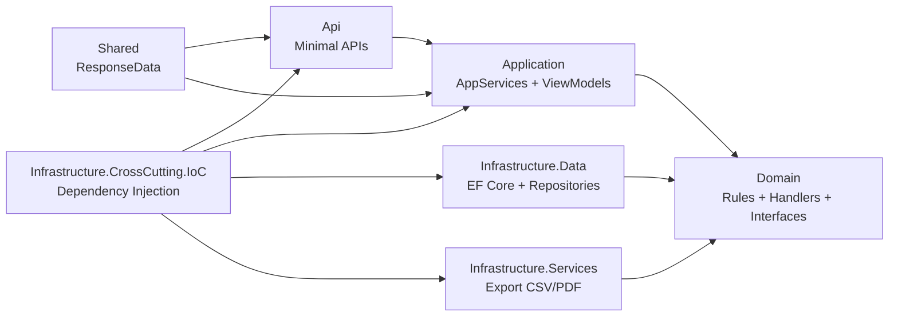

# CleanArchReference — Projeto Referência de Estudo

> **Clean Architecture · CQRS · Design Patterns · Boas Práticas .NET 9 + React 19**
>
> Projeto de referência para estudo de arquitetura de software, design patterns e boas práticas de desenvolvimento.
> Domínio fiscal (obrigações acessórias) utilizado como pano de fundo para demonstrar padrões arquiteturais reais.

---

## 🎯 Objetivo

Este projeto serve como **material de estudo prático** sobre:

| Pattern / Prática | Onde ver |
|---|---|
| **Clean Architecture** (6+1 projetos) | Separação total entre camadas — Domain sem dependências |
| **CQRS** com MediatR | Commands vs Queries, `IRequest<T>`, pipelines |
| **Validação com FluentValidation** | `ValidationBehavior<TRequest, TResponse>` pipeline |
| **Domain Events** `INotification` | Side effects desacoplados (cache, search indexing) |
| **Repository Pattern + UnitOfWork** | `IUnitOfWork.CompleteAsync()` centraliza transações |
| **Strategy Pattern** | `TributaryRulesEngine` — regras por regime tributário |
| **Decorator Pattern** | `CachedDashboardAppService` decorando `IDashboardAppService` |
| **Fluent Builder / Configurations** | EF Core Fluent API em arquivos `Configuration/` |
| **AutoMapper Profiles** | ViewModels ↔ Models mapping |
| **Minimal APIs** | Endpoints funcionais com `MapGroup` |
| **Exception Middleware** | Tratamento global de erros sem try/catch nos endpoints |
| **Domain Services puros** | `DueDateCalculator`, `BusinessDayAdjuster` sem dependências |
| **Cache-aside + Event Invalidation** | Redis com invalidação por domain events |
| **Soft Delete + RowVersion** | Concorrência e deleção lógica |

---

## Stack Tecnológica

| Camada | Tecnologia |
|---|---|
| **Backend** | .NET 9, ASP.NET Core, EF Core 9, Npgsql |
| **CQRS / Validação** | MediatR 12, FluentValidation 11, AutoMapper 13 |
| **Banco de Dados** | PostgreSQL 16 |
| **Cache** | Redis 7 (StackExchange.Redis) |
| **Busca** | Meilisearch 1.9 |
| **Frontend** | React 19, Vite 6, TypeScript 5 |
| **UI** | Ant Design 5, TanStack Query 5, Axios, Dayjs |
| **Infraestrutura** | Docker Compose, Nginx |
| **Testes** | xUnit, Moq, FluentAssertions, Vitest, Testing Library, MSW |
| **CI / Cobertura** | GitHub Actions, coverlet, Vitest v8 coverage |

---

## Como Rodar

### Docker Compose (recomendado)

```bash
docker compose up --build -d
```

A stack (5 containers) fica pronta em ~30 segundos. Dados de demonstração populados automaticamente.

### Script auxiliar

```bash
# Sobe, aguarda health checks e exibe URLs
./start.ps1

# Com logs em tempo real
./start.ps1 -Logs

# Sem rebuild
./start.ps1 -NoBuild
```

### Acessar

| Serviço | URL |
|---|---|
| Frontend | http://localhost:3000 |
| API (Swagger) | http://localhost:8080/swagger |
| Meilisearch | http://localhost:7700 |

---

## Arquitetura

### Clean Architecture em 7 Projetos

```
Api → Application → Domain
Api → IoC → Infrastructure.Data → Domain
```

O **Domain** é o centro — zero dependências de infraestrutura, banco ou HTTP.

| Projeto | Responsabilidade | Pattern |
|---|---|---|
| `Domain` | Commands, Handlers, Validators, Models, Repository interfaces, Domain Events, Domain Services | **Pure Domain** — zero dependências externas |
| `Application` | ViewModels, AppServices (fachadas finas), AutoMapper Profiles | **Facade + DTO** |
| `Infrastructure.Data` | EF Core DbContext, Repositories concretos, Migrations, Seed | **Repository + UnitOfWork** |
| `Infrastructure.CrossCutting.IoC` | DI composition root (ProjectBootstrapper) | **Composition Root** |
| `Infrastructure.Services` | Exportação (CSV / PDF) | **Strategy** |
| `Api` | Endpoints (Minimal API), Middleware, Program.cs | **Minimal API + Middleware Pipeline** |
| `Shared` | ResponseData envelope, ResponseErrorCode | **Envelope Pattern** |

### Fluxo de Requisição (CQRS Pipeline)

```
Endpoint → AppService → IMediatrService → ValidationBehavior → CommandHandler → Repository → IUnitOfWork
```

### Frontend (Feature-Based Architecture)

```
Page → Hook (TanStack Query) → Service → api/axios → API
```

### Diagrama de Camadas



---

## Design Patterns Demonstrados

| Pattern | Localização | Descrição |
|---|---|---|
| **Command Pattern** | `Domain/*/Commands/*.cs` | Commands como objetos imutáveis (`record`) |
| **Mediator Pattern** | `MediatrService` | Desacopla sender de handler via MediatR |
| **Chain of Responsibility** | `ValidationBehavior` | Pipeline de validação antes do handler |
| **Strategy Pattern** | `TributaryRulesEngine` | Regras por regime tributário intercambiáveis |
| **Repository Pattern** | `Domain/*/Interfaces/I*Repository.cs` | Abstração de persistência |
| **Unit of Work** | `Infrastructure.Data/Context/UnitOfWork.cs` | Transações atômicas |
| **Decorator Pattern** | `CachedDashboardAppService` | Adiciona cache sem modificar o serviço original |
| **Observer Pattern** | Domain Events (`INotification`) | Eventos disparam handlers desacoplados |
| **Facade Pattern** | `Application/*/Services/*AppService.cs` | Fachadas finas para os endpoints |
| **Fluent Builder** | `Configurations/*.cs` | Fluent API do EF Core |
| **DTO Pattern** | ViewModels | Isolamento entre domínio e API |
| **Envelope Pattern** | `ResponseData<T>` | Resposta padronizada |
| **Singleton / Lifetime** | DI Container | Scoped, Singleton, Transient |
| **Exception Middleware** | `ExceptionMiddleware` | Tratamento global de erros |
| **Options Pattern** | `IConfiguration` + `IOptions<T>` | Configuração tipada |

Para mais detalhes, veja a [Documentação do Sistema](src/web) na interface web em `/documentacao`.

---

## Engine de Regras Tributárias

O coração do sistema é a `TributaryRulesEngine`, que decide quais obrigações cada empresa deve entregar com base no regime tributário. A engine reside no domínio puro, sem dependências externas — um exemplo prático de **Strategy Pattern** + **Domain Service**.

Detalhamento completo: [`docs/tributary-rules-engine.md`](docs/tributary-rules-engine.md).

---

## Decisões Técnicas (ADRs)

As decisões arquiteturais estão documentadas como ADRs em [`docs/decisions/`](docs/decisions/).

| ADR | Decisão |
|---|---|
| ADR-001 | Clean Architecture com 7 projetos |
| ADR-002 | MediatR + CQRS + ValidationBehavior |
| ADR-003 | PostgreSQL + EF Core 9 |
| ADR-004 | Redis para cache do Dashboard |
| ADR-005 | Meilisearch para busca textual |
| ADR-006 | Docker Compose com 5 serviços |

---

## Testes

### Backend — 163 testes unitários + 4 de integração

```bash
dotnet test src/api/CleanArchReference.Tests/CleanArchReference.Tests.csproj
dotnet test src/api/CleanArchReference.IntegrationTests/CleanArchReference.IntegrationTests.csproj
```

### Frontend — 174 testes (38 arquivos) | Coverage ~87%

```bash
cd src/web
npm run test              # executa uma vez
npm run test:watch        # modo watch
npm run test:coverage     # com relatório de cobertura
```

---

## Segurança e Limitações

Projeto desenvolvido para fins de estudo e demonstração. Uma revisão de segurança foi realizada considerando um cenário produtivo.

- Rate Limiting (100 req/min global, 5 req/min export)
- Security Headers (7 headers via middleware + Nginx)
- CORS restrito a origens conhecidas
- Proteção contra CSV Injection
- Exception handling sem vazamento de detalhes
- Cache invalidation via eventos de domínio

Detalhamento completo: [`docs/security.md`](docs/security.md).

---

## Documentação Complementar

| Documento | Conteúdo |
|---|---|
| [`docs/INDEX.md`](docs/INDEX.md) | Índice completo da documentação |
| [`docs/architecture.md`](docs/architecture.md) | Arquitetura C4 e diagramas detalhados |
| [`docs/tributary-rules-engine.md`](docs/tributary-rules-engine.md) | Regras tributárias e vencimentos |
| [`docs/security.md`](docs/security.md) | Segurança e limitações |
| [`docs/decisions/`](docs/decisions/) | ADRs e decisões técnicas |
| [`docs/backend/rules.md`](docs/backend/rules.md) | Convenções e padrões .NET |
| [`docs/frontend/architecture.md`](docs/frontend/architecture.md) | Arquitetura React |
| [`AGENTS.md`](AGENTS.md) | Orientações para agentes de IA |
