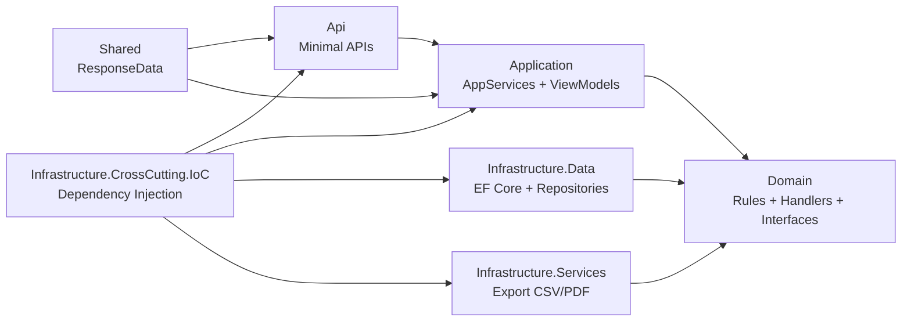
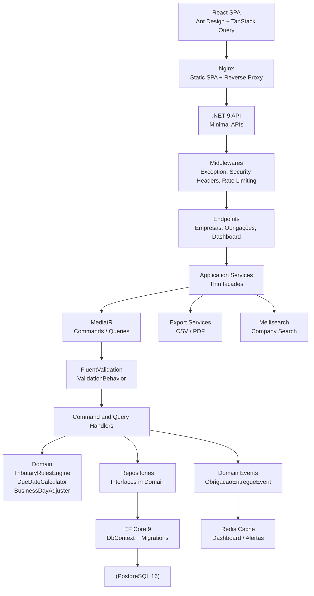

# Painel de Obrigações Acessórias — e-Auditoria

> Sistema para controle centralizado de obrigações fiscais acessórias com geração automática, cálculo de vencimentos e alertas.

---

## Visão Geral

Escritórios contábeis gerenciam dezenas de CNPJs com regimes tributários distintos — cada regime exige um conjunto diferente de obrigações acessórias (DAS, DCTF, EFD, eSocial, SPED, DIRF, RAIS), cada uma com sua própria regra de vencimento. Perder um prazo significa multa.

A maioria ainda gerencia isso em planilhas.

Este sistema centraliza o cadastro de empresas, gera automaticamente as obrigações de acordo com as regras de cada regime, calcula vencimentos considerando feriados e dias úteis, controla entregas e alerta sobre prazos próximos ou vencidos.

---

## Funcionalidades

| Funcionalidade | Descrição |
|---|---|
| **Gestão de Empresas** | Cadastro com CNPJ, razão social e regime tributário. Busca textual com Meilisearch. |
| **Geração Automática de Obrigações** | Ao cadastrar uma empresa, 12 meses de obrigações são gerados conforme as regras do regime. |
| **Calendário de Obrigações** | Visualização mensal por empresa com status (Pendente / Atrasada / Entregue) e filtros. |
| **Registro de Entregas** | Marcar obrigações como entregues com data de conclusão. |
| **Dashboard** | Totais consolidados: empresas, obrigações do mês, pendentes, entregues, atrasadas. |
| **Painel de Alertas** | Obrigações vencendo em até 30 dias ou já atrasadas, ordenadas por urgência. |
| **Cache** | Dashboard e alertas cacheados em Redis com invalidação por evento de domínio. |
| **Busca Textual** | Empresas indexadas no Meilisearch com busca typo-tolerant. |

---

## Stack Tecnológica

| Camada | Tecnologia |
|---|---|
| **Backend** | .NET 9, ASP.NET Core, EF Core 9, Npgsql |
| **CQRS / Validação** | MediatR 12, FluentValidation 11, AutoMapper 13 |
| **Banco de Dados** | PostgreSQL 16 |
| **Cache** | Redis 7 (StackExchange.Redis) |
| **Busca** | Meilisearch 1.9 |
| **Frontend** | React 19, Vite 6, TypeScript 5 |
| **UI** | Ant Design 5, TanStack Query 5, Axios, Dayjs |
| **Infraestrutura** | Docker Compose, Nginx |
| **Testes** | xUnit, Moq, FluentAssertions |

---

## Como Rodar

### Docker Compose (recomendado)

```bash
docker compose up --build -d
```

A stack (5 containers) fica pronta em ~30 segundos. Dados de demonstração populados automaticamente.

### Script auxiliar

```bash
# Sobe, aguarda health checks e exibe URLs
./start.ps1

# Com logs em tempo real
./start.ps1 -Logs

# Sem rebuild
./start.ps1 -NoBuild
```

### Acessar

| Serviço | URL |
|---|---|
| Frontend | http://localhost:3000 |
| API (Swagger) | http://localhost:8080/swagger |
| Meilisearch | http://localhost:7700 |

### Dados de Demonstração

4 empresas (uma de cada regime tributário) com 12 meses de obrigações geradas para o ano corrente.

---

## Arquitetura

### Clean Architecture em 7 Projetos

```
Api → Application → Domain
Api → IoC → Infrastructure.Data → Domain
```

O **Domain** é o centro — zero dependências de infraestrutura, banco ou HTTP.

| Projeto | Responsabilidade |
|---|---|
| `Domain` | Commands, Handlers, Validators, Models, Repository interfaces, Domain Events |
| `Application` | ViewModels, AppServices (fachadas finas), AutoMapper Profiles |
| `Infrastructure.Data` | EF Core DbContext, Repositories concretos, Migrations, Seed |
| `Infrastructure.CrossCutting.IoC` | DI composition root (ProjectBootstrapper) |
| `Infrastructure.Services` | Exportação (CSV / PDF) |
| `Api` | Endpoints (Minimal API), Middleware, Program.cs |
| `Shared` | ResponseData envelope, ResponseErrorCode |

### Fluxo de Requisição

```
Endpoint → AppService → IMediatrService → ValidationBehavior → CommandHandler → Repository → IUnitOfWork
```

### Frontend

```
Page → Hook (TanStack Query) → Service → api/axios → API
```

Organização por domínio, com `BaseService<TEntity, TCreate, TUpdate>`, barrel exports, path aliases `@/` e React Router DOM.

### Diagrama de Camadas



---

## Diagrama da API



---

## Engine de Regras Tributárias

O coração do sistema é a `TributaryRulesEngine`, que decide quais obrigações cada empresa deve entregar com base no regime tributário. A engine reside no domínio puro, sem dependências externas.

### Matriz de Obrigações

| Regime | Obrigações Mensais | Obrigações Anuais (Janeiro) |
|---|---|---|
| Simples Nacional | DAS, eSocial | DEFIS, DIRF, RAIS |
| Lucro Presumido | DCTF, EFD-ICMS/IPI, EFD Contribuições, EFD-Reinf, eSocial | SPED ECD, SPED ECF, DIRF, RAIS |
| Lucro Real | DCTF, EFD-ICMS/IPI, EFD Contribuições, EFD-Reinf, eSocial | SPED ECD, SPED ECF, DIRF, RAIS |
| Imunidade / Isenção | Nenhuma | Nenhuma |

### Características

- **Regimes suportados:** Simples Nacional, Lucro Presumido, Lucro Real, Imunidade/Isenção.
- **Obrigações anuais** são geradas apenas em janeiro.
- **Vencimentos calculados automaticamente** com base em cada tipo de obrigação (DAS no dia 20 do mês seguinte, DCTF no dia 15 do segundo mês, SPED ECD em 31 de maio do ano seguinte, etc.).
- **DAS** ajusta para o próximo dia útil quando o vencimento cai em fim de semana ou feriado.
- **Feriados nacionais** considerados — implementados via `BrazilianHolidayProvider` com feriados fixos e móveis (algoritmo de Gauss para Páscoa, Carnaval, Corpus Christi).
- **Obrigações não aplicáveis** não são persistidas — a engine gera apenas obrigações devidas, mantendo o banco de dados enxuto.

Detalhamento completo: [`docs/tributary-rules-engine.md`](docs/tributary-rules-engine.md).

---

## Decisões Técnicas

| Decisão | Escolha | Justificativa |
|---|---|---|
| Backend | .NET 9 com Minimal APIs | Requisito do case; endpoints finos e regras isoladas no Domain/Application. |
| Arquitetura | Clean Architecture (7 projetos) | Separação clara entre API, aplicação, domínio e infraestrutura — extensibilidade e testabilidade. |
| CQRS | MediatR + FluentValidation | Commands/Queries com pipeline de validação isolada dos handlers. |
| Busca | Meilisearch | Demonstra busca dedicada com typo-tolerance; em produção pequena, PostgreSQL + pg_trgm seria suficiente. |
| Cache | Redis + invalidação por evento | Reduz recomputação de dashboard/alertas; TTL como fallback para segurança. |
| Concorrência | RowVersion (concurrency token) | EF Core gerencia conflitos de escrita em registro de entrega. |
| Obrigações não aplicáveis | Não persistidas | Banco enxuto e queries mais simples; status "Não Aplicável" reservado para evolução. |
| Geração de obrigações | Ano-calendário corrente | Facilita demonstração de pendências, atrasos e alertas. |
| Feriados | Provider nacional extensível | Interface `IHolidayProvider` permite trocar implementação (municipal, estadual). |
| Envelope de resposta | ResponseData\<T\> | Consistência com frontend; `ProblemDetails` (RFC 7807) seria o padrão em produção. |

As decisões foram calibradas para demonstrar organização, extensibilidade e domínio de arquitetura em um escopo reduzido de case técnico. Em um produto real, cada escolha seria reavaliada conforme volume, custo operacional, time e prazo.

ADRs detalhados: [`docs/decisions/`](docs/decisions/).

---

## Testes

- **76 testes unitários** — engine tributária, cálculo de vencimentos, CommandHandlers, QueryHandlers, Validators, AppServices, ValidationBehavior e Event Handlers.
- **13 testes de integração** — via `WebApplicationFactory<Program>` com banco InMemory, Redis em memória e Meilisearch stub no-op. Cobrem todos os 13 endpoints da API.

```bash
# Unitários
dotnet test src/api/PainelObrigacoes.Tests/PainelObrigacoes.Tests.csproj

# Integração
dotnet test src/api/PainelObrigacoes.IntegrationTests/PainelObrigacoes.IntegrationTests.csproj
```

---

## Segurança e Limitações

Este projeto foi desenvolvido para execução local e avaliação técnica. Uma revisão de segurança foi realizada considerando um cenário produtivo. Como o case é uma aplicação local de demonstração, itens como autenticação, multi-tenant e gestão de segredos foram documentados como evoluções futuras.

### Implementado

- Rate Limiting (100 req/min global, 5 req/min export)
- Security Headers (7 headers via middleware + Nginx)
- CORS restrito a origens conhecidas
- Proteção contra CSV Injection
- Tratamento de exceções sem vazamento de detalhes em produção
- Cache invalidation via eventos de domínio
- HTTPS + HSTS no Nginx

### Não implementado (decisão consciente)

| Item | Motivo |
|---|---|
| Autenticação JWT | Não solicitado no case; sem valor agregado ao escopo de demonstração |
| CSRF | Sem cookies de sessão, sem risco |
| Secrets management | Configurações em docker-compose para execução imediata |
| Multi-tenant | Sem conceito de usuário no escopo do case |

Detalhamento completo: [`docs/security.md`](docs/security.md).

---

## Uso de IA no Desenvolvimento

Ferramentas utilizadas como aceleradores de desenvolvimento, não como substitutos de revisão técnica:

- **Claude (Anthropic):** Planejamento inicial, arquitetura da solução e documentação.
- **OpenCode + DeepSeek V4 Flash:** Implementação assistida de módulos, testes e frontend.
- **Revisão manual:** Arquitetura, separação de responsabilidades, handlers, validações e consistência com os requisitos do case.

As decisões de arquitetura, correções de padrões e validação final foram conduzidas manualmente.

---

## Documentação Complementar

| Documento | Conteúdo |
|---|---|
| [`docs/INDEX.md`](docs/INDEX.md) | Índice completo da documentação |
| [`docs/architecture.md`](docs/architecture.md) | Arquitetura C4 e diagramas detalhados |
| [`docs/tributary-rules-engine.md`](docs/tributary-rules-engine.md) | Regras tributárias e vencimentos |
| [`docs/security.md`](docs/security.md) | Segurança e limitações |
| [`docs/decisions/`](docs/decisions/) | ADRs e decisões técnicas |
| [`docs/backend/rules.md`](docs/backend/rules.md) | Convenções e padrões .NET |
| [`docs/frontend/architecture.md`](docs/frontend/architecture.md) | Arquitetura React |
| [`AGENTS.md`](AGENTS.md) | Orientações para agentes de IA |
