# Documentation Index

> Master navigation for the case_e-Auditoria documentation.

---

## Site Map

```mermaid
graph TD
    START([Start Here]) --> AGENTS[AGENTS.md<br/>Master Rules]
    START --> CLAUDE[CLAUDE.md<br/>Tool Guidance]
    START --> OPENCODE[.opencode.json<br/>AI Config]

    AGENTS --> DOCS[docs/INDEX.md<br/>Documentation Hub]

    DOCS --> CORE[Core Docs]
    DOCS --> BE[Backend]
    DOCS --> FE[Frontend]
    DOCS --> SHARED[Shared]
    DOCS --> ADR[Decisions]

    CORE --> ARCH[docs/architecture.md]
    CORE --> GLOSS[docs/GLOSSARY.md]
    CORE --> ROAD[docs/ROADMAP.md]
    CORE --> DEV[docs/development-setup.md]
    CORE --> ENGINE[docs/tributary-rules-engine.md]

    BE --> BE_RULES[docs/backend/rules.md]
    BE --> BE_CTRL[docs/backend/endpoints.md]
    BE --> BE_EVENTS[docs/backend/domain-events.md]
    BE --> BE_RESP[docs/backend/response-data.md]
    BE --> BE_TEST[docs/backend/testing/]

    FE --> FE_ARCH[docs/frontend/architecture.md]
    FE --> FE_RULES[docs/frontend/rules.md]
    FE --> FE_COMP[docs/frontend/components.md]
    FE --> FE_TEST[docs/frontend/testing/]

    SHARED --> SH_DOCKER[docs/shared/docker-compose.md]
    SHARED --> SH_SEED[docs/shared/data-seed.md]

    ADR --> ADR1[docs/decisions/ADR-001-*]
    ADR --> ADR2[docs/decisions/ADR-002-*]
    ADR --> ADRn[docs/decisions/ADR-003-* ...]
```

---

## Document List

### Core Documentation

| File | Scope | Description |
|---|---|---|
| [GLOSSARY.md](GLOSSARY.md) | SH | Domain terminology and abbreviations |
| [ROADMAP.md](ROADMAP.md) | SH | Product vision, roadmap, and backlog |
| [development-setup.md](development-setup.md) | SH | Local development environment setup |
| [architecture.md](architecture.md) | SH | C4 architecture diagrams and layer details |
| [tributary-rules-engine.md](tributary-rules-engine.md) | BE | Fiscal obligation generation engine |
| [security.md](security.md) | SH | Security implementations and trade-offs |

### Backend

| File | Scope | Description |
|---|---|---|
| [backend/rules.md](backend/rules.md) | BE | .NET conventions, patterns, coding standards |
| [backend/endpoints.md](backend/endpoints.md) | BE | Endpoint patterns and Minimal API conventions |
| [backend/domain-events.md](backend/domain-events.md) | BE | MediatR INotification events |
| [backend/response-data.md](backend/response-data.md) | BE | ResponseData envelope contract |
| [backend/testing/setup.md](backend/testing/setup.md) | BE | Test project configuration |
| [backend/testing/best-practices.md](backend/testing/best-practices.md) | BE | Testing conventions |

### Frontend

| File | Scope | Description |
|---|---|---|
| [frontend/architecture.md](frontend/architecture.md) | FE | React layers, data flow, routing |
| [frontend/rules.md](frontend/rules.md) | FE | TypeScript/React coding standards |
| [frontend/components.md](frontend/components.md) | FE | Reusable component catalog |
| [frontend/testing/setup.md](frontend/testing/setup.md) | FE | Frontend test configuration |
| [frontend/testing/best-practices.md](frontend/testing/best-practices.md) | FE | Frontend testing guidelines |

### Shared Infrastructure

| File | Scope | Description |
|---|---|---|
| [shared/docker-compose.md](shared/docker-compose.md) | SH | Docker Compose services and networking |
| [shared/data-seed.md](shared/data-seed.md) | SH | Database seeding and migration strategy |

### Architecture Decision Records

| File | Scope | Description |
|---|---|---|
| [decisions/ADR-001-clean-architecture.md](decisions/ADR-001-clean-architecture.md) | SH | Clean Architecture with 6 projects |
| [decisions/ADR-002-mediatr-cqrs.md](decisions/ADR-002-mediatr-cqrs.md) | SH | MediatR + CQRS + ValidationBehavior |
| [decisions/ADR-003-postgresql-efcore.md](decisions/ADR-003-postgresql-efcore.md) | SH | PostgreSQL + EF Core 9 |
| [decisions/ADR-004-redis-cache.md](decisions/ADR-004-redis-cache.md) | SH | Redis for Dashboard caching |
| [decisions/ADR-005-meilisearch.md](decisions/ADR-005-meilisearch.md) | SH | Meilisearch for full-text search |
| [decisions/ADR-006-docker-compose.md](decisions/ADR-006-docker-compose.md) | SH | Docker Compose orchestration |

### Agent Definitions

| File | Scope | Description |
|---|---|---|
| [AGENTS.md](/AGENTS.md) | SH | Master agent persona and rules |
| [CLAUDE.md](/CLAUDE.md) | SH | Claude Code project guidance |
| [agents/specialists/backend-architect.md](/agents/specialists/backend-architect.md) | BE | Backend architecture specialist |
| [agents/specialists/frontend-architect.md](/agents/specialists/frontend-architect.md) | FE | Frontend architecture specialist |
| [agents/specialists/tributary-engineer.md](/agents/specialists/tributary-engineer.md) | BE | Fiscal rules engineer |
| [agents/security/code-reviewer.md](/agents/security/code-reviewer.md) | SH | Code review specialist |

---

## Legend

| Tag | Meaning |
|---|---|
| BE | Backend |
| FE | Frontend |
| SH | Shared / Cross-cutting |
