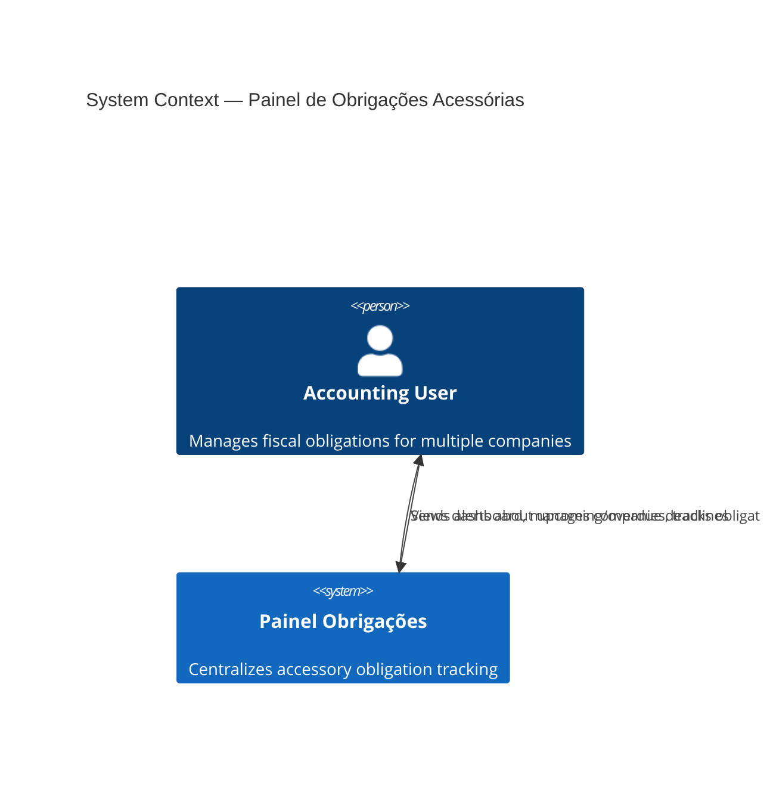
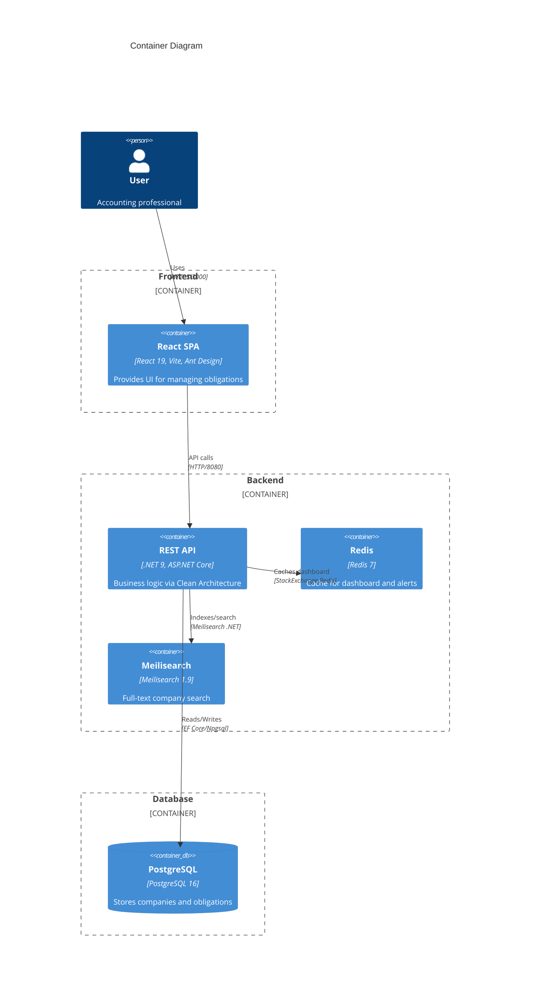
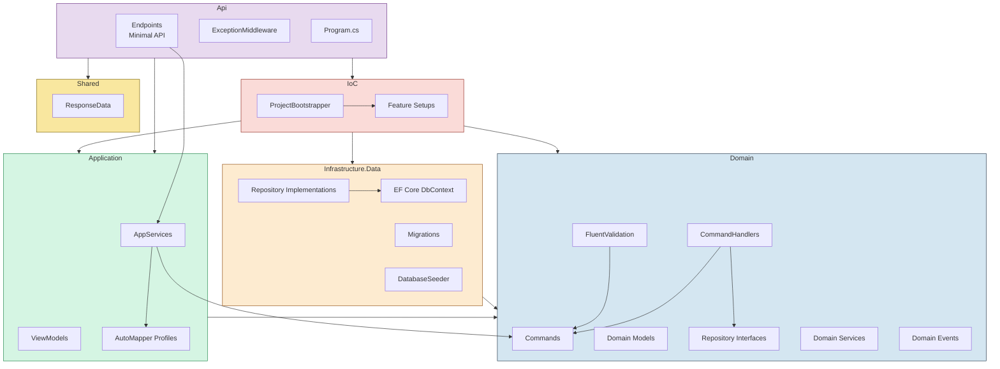
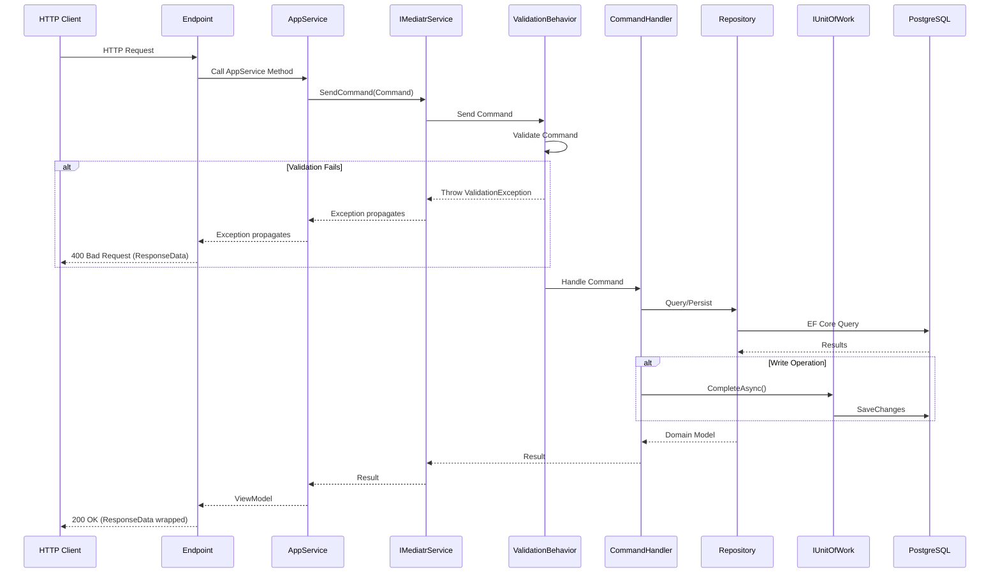
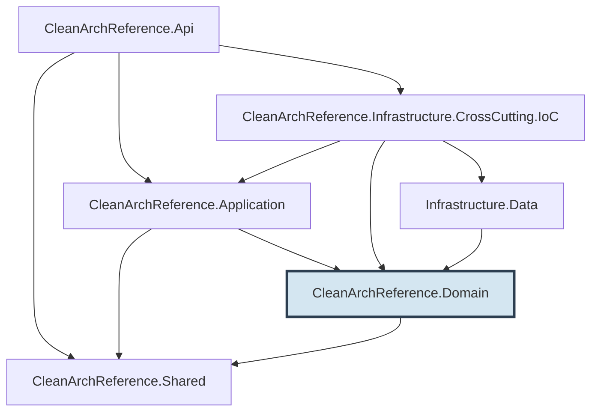

# Architecture

> Clean Architecture with MediatR CQRS, EF Core, and PostgreSQL.

---

## C4 Context Diagram



## C4 Container Diagram



---

## Clean Architecture Layers



---

## Request Flow



---

## Project Dependencies



The **Domain** project has zero references to any other project in the solution — it's the innermost layer.

---

## Feature Organization

Each business feature follows the same folder structure across all layers:

```
Domain/{Feature}/
├── Commands/           → CreateXCommand, DeleteXCommand : Command<TResult> (writes)
├── Queries/            → FindXQuery, GetXQuery : Query<TResult> (reads)
├── CommandHandlers/    → CreateXCommandHandler, DeleteXCommandHandler
├── QueryHandlers/      → FindXQueryHandler, GetXQueryHandler
├── Models/             → XModel (domain), XReadModel (queries)
├── Repositories/       → IXRepository (interface only)
├── Services/           → IXService (domain logic interfaces)
├── Validations/        → CreateXCommandValidation, FindXQueryValidation
└── Events/             → XCreatedEvent, XDeletedEvent (INotification)

Application/{Feature}/
├── ViewModels/         → CreateXViewModel, XResultViewModel
├── Services/           → IXAppService (interface + implementation)
└── AutoMapper/         → XProfile

Infrastructure.Data/{Feature}/
└── Repositories/       → XRepository (EF Core implementation)
```

---

## Key Patterns

### ResponseData Envelope

All API responses follow the same envelope:

```json
{
  "success": true,
  "message": "",
  "data": { ... },
  "errorCode": null
}
```

| ErrorCode | HTTP Status |
|---|---|
| `null` | 200 OK |
| `Validation` | 400 Bad Request |
| `NotFound` | 404 Not Found |
| `Conflict` | 409 Conflict |
| `InternalError` | 500 Internal Server Error |

### Validation Pipeline

FluentValidation validators are registered per Command and executed automatically by `ValidationBehavior<TRequest, TResponse>` — a MediatR `IPipelineBehavior`.

### Domain Events

Side effects (search indexing, cache invalidation) are handled via MediatR `INotification`:

```
CommandHandler → CompleteAsync → Publish(Event) → NotificationHandler → Index/Invalidate
```
