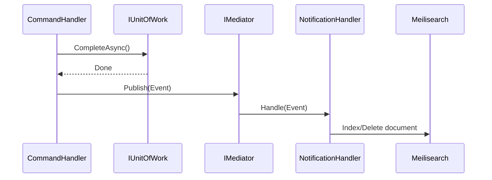

# Domain Events

> Side-effect propagation via MediatR `INotification`.

---

## Pattern

Side effects (search indexing, cache invalidation) are handled through domain events, keeping CommandHandlers and AppServices focused on their primary responsibility.



---

## Events

### EmpresaCreatedEvent

Published after a company is successfully created with all obligations.

```csharp
public sealed record EmpresaCreatedEvent(
    Guid EmpresaId,
    string CNPJ,
    string RazaoSocial,
    RegimeTributario Regime) : INotification;
```

**Handler:** `EmpresaCreatedHandler` — indexes the company in Meilisearch.

### EmpresaDeletedEvent

Published after a company is soft-deleted.

```csharp
public sealed record EmpresaDeletedEvent(Guid EmpresaId) : INotification;
```

**Handler:** `EmpresaDeletedHandler` — removes company from Meilisearch index.

---

## How to Add a New Event

1. Create the event record in `Domain/{Feature}/Events/`:
```csharp
public sealed record SomethingHappenedEvent(Guid EntityId) : INotification;
```

2. Publish from the CommandHandler after `CompleteAsync`:
```csharp
await _mediator.Publish(new SomethingHappenedEvent(model.Id), ct);
```

3. Create handler in `Infrastructure.Data/Events/`:
```csharp
public sealed class SomethingHappenedHandler : INotificationHandler<SomethingHappenedEvent>
{
    public async Task Handle(SomethingHappenedEvent notification, CancellationToken ct)
    {
        // Side effect logic here
    }
}
```

4. Register in IoC (`EmpresaSetup.cs` or equivalent):
```csharp
services.AddScoped<INotificationHandler<SomethingHappenedEvent>, SomethingHappenedHandler>();
```

---

## Key Files

| File | Path |
|---|---|
| Events | `Domain/Empresas/Events/` |
| Handlers | `Infrastructure.Data/Events/` |
| Registration | `Infrastructure.CrossCutting.IoC/Empresas/EmpresaSetup.cs` |
