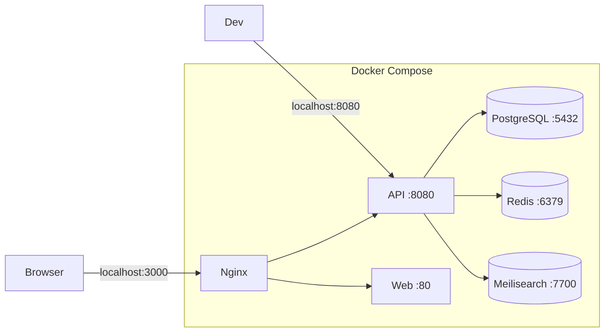

# Development Setup

> How to set up and run the project locally.

---

## Prerequisites

| Tool | Version | Required For |
|---|---|---|
| [Docker Desktop](https://www.docker.com/products/docker-desktop/) | Latest | Running the full stack |
| [.NET SDK](https://dotnet.microsoft.com/download) | 9.0+ | Local build / test |
| [Node.js](https://nodejs.org/) | 20+ | Frontend development |
| IDE | VS 2022 / Rider / VS Code | Coding |

---

## Quick Start

```bash
# 1. Clone and enter project
cd case_e-Auditoria

# 2. Start all services
docker compose up --build -d

# 3. Wait for health checks (~30 seconds)
docker compose ps

# 4. Open in browser
# Frontend: http://localhost:3000
# API:      http://localhost:8080/swagger
# Meilisearch: http://localhost:7700
```

The database seed runs automatically on first startup, creating 4 demo companies with their obligations for the current year.

---

## Docker Services



| Service | Image | Port | Purpose |
|---|---|---|---|
| `db` | postgres:16-alpine | 5432 | Main database |
| `redis` | redis:7-alpine | 6379 | Cache for dashboard/alertas |
| `meilisearch` | getmeili/meilisearch:v1.9 | 7700 | Full-text search engine |
| `api` | custom (Dockerfile) | 8080 | .NET 9 API |
| `web` | custom (Dockerfile) | 3000:80 | React SPA via Nginx |

---

## Local Development (without Docker)

### Database

```bash
# Start only PostgreSQL
docker compose up -d db redis meilisearch

# Apply migrations
cd src/api
dotnet ef database update --project PainelObrigacoes.Infrastructure.Data --startup-project PainelObrigacoes.Api
```

### Backend

```bash
# From project root
dotnet build src/api/PainelObrigacoes.Api/PainelObrigacoes.Api.csproj
dotnet run --project src/api/PainelObrigacoes.Api/PainelObrigacoes.Api.csproj

# API available at http://localhost:8080
# Swagger at http://localhost:8080/swagger
```

### Frontend

```bash
cd src/web
npm install
npm run dev

# Available at http://localhost:5173
# Proxies /api to http://localhost:8080
```

---

## Testing

```bash
# Run all backend tests
dotnet test src/api/PainelObrigacoes.Tests/PainelObrigacoes.Tests.csproj

# Run with verbose output
dotnet test src/api/PainelObrigacoes.Tests/PainelObrigacoes.Tests.csproj --verbosity normal

# Filter specific tests
dotnet test src/api/PainelObrigacoes.Tests/PainelObrigacoes.Tests.csproj --filter "FullyQualifiedName~TributaryRulesEngine"
```

---

## Environment Variables

| Variable | Default | Description |
|---|---|---|
| `ConnectionStrings__DefaultConnection` | `Host=db;Port=5432;...` | PostgreSQL connection string |
| `ConnectionStrings__Redis` | `redis:6379` | Redis connection string |
| `Meilisearch__Url` | `http://meilisearch:7700` | Meilisearch URL |
| `Meilisearch__MasterKey` | `masterKey123` | Meilisearch API key |
| `VITE_API_URL` | `http://localhost:8080` | API base URL for frontend |

---

## Project Structure

```
/
├── src/
│   ├── api/           → .NET solution (7 projects)
│   │   └── PainelObrigacoes.slnx
│   └── web/           → React + Vite frontend
├── docker-compose.yml → Infrastructure orchestration
├── AGENTS.md          → AI agent configuration
├── docs/              → Documentation hub
└── .gitignore
```
