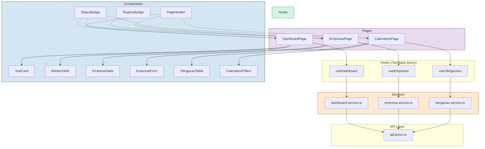
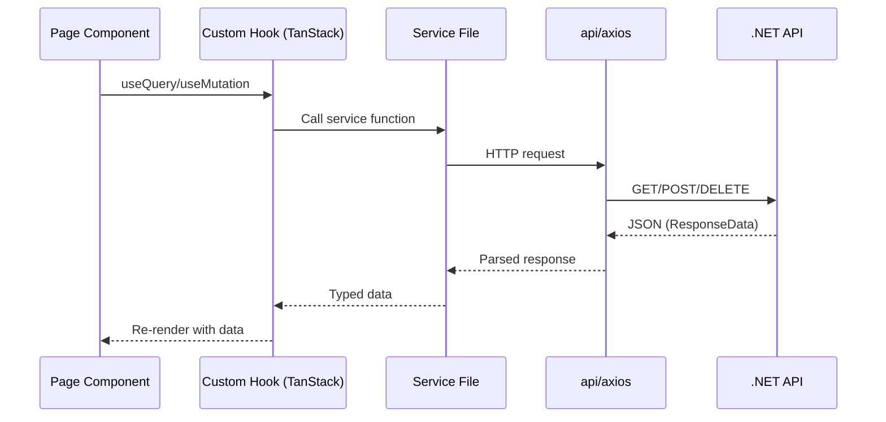

# Frontend Architecture

> React 19 feature-based architecture with TanStack Query.

---

## Layer Diagram



---

## Data Flow



---

## Route Structure

| Route | Page Component | Description |
|---|---|---|
| `/` | Redirect to `/dashboard` | Root |
| `/dashboard` | `DashboardPage` | Statistics + alerts |
| `/empresas` | `EmpresasPage` | Company CRUD |
| `/calendario` | `CalendarioPage` | Obligation calendar |
| `/alertas` | `DashboardPage showOnlyAlertas` | Alert list view |

---

## Key Dependencies

| Package | Purpose |
|---|---|
| `antd` | UI components (Table, Form, Layout, Modal, Select, DatePicker) |
| `@ant-design/icons` | Icon library |
| `@tanstack/react-query` | Server state management |
| `axios` | HTTP client |
| `dayjs` | Date manipulation (locale pt-BR) |

---

## Project Structure

```
src/web/src/
├── infrastructure/http/ → axios.ts (base instance + interceptors)
├── application/services/ → HTTP calls per feature (class-based services)
├── hooks/         → TanStack Query hooks
├── pages/         → Route-level components
├── components/    → Reusable UI components
├── domain/types/  → TypeScript interfaces and enums
├── shared/        → BaseService, ApiResponse, utilities
├── lib/           → Query key factories
├── context/       → Theme context
├── theme/         → Ant Design theme config
└── utils/         → Formatters and helpers
```
