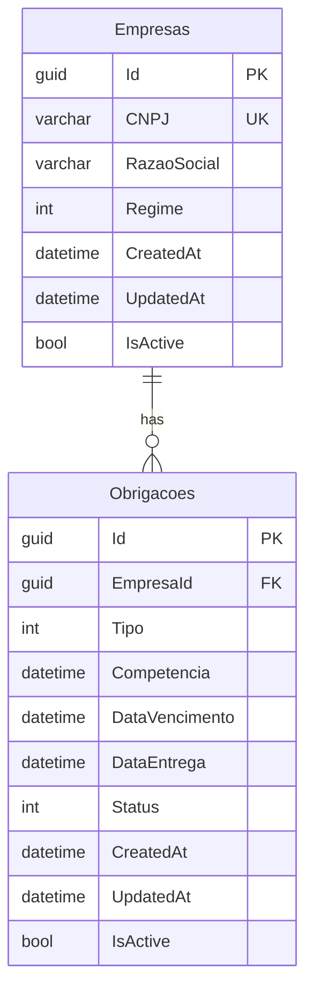

# Data Seed and Migrations

> Database initialization strategy.

---

## Migration Strategy

EF Core migrations are generated and applied at startup:

```csharp
// Program.cs
using (var scope = app.Services.CreateScope())
{
    var db = scope.ServiceProvider.GetRequiredService<AppDbContext>();
    db.Database.Migrate();
    await DatabaseSeeder.SeedAsync(scope.ServiceProvider);
}
```

### Adding a Migration

```bash
cd src/api

# With database running
docker compose up -d db

# Generate migration
dotnet ef migrations add MigrationName \
  --project CleanArchReference.Infrastructure.Data \
  --startup-project CleanArchReference.Api
```

---

## Seed Data

The `DatabaseSeeder` runs automatically on first startup (checks if data exists before seeding).

### Demo Companies

| CNPJ | Company Name | Tax Regime |
|---|---|---|
| `11222333000181` | Padaria São João Ltda | Simples Nacional |
| `22333444000172` | Consultoria Fiscal Omega S.A. | Lucro Presumido |
| `33444555000163` | Banco Meridional S.A. | Lucro Real |
| `44555666000154` | Instituto Educar Brasil | Imunidade/Isenção |

### Seed Behavior

1. Checks if any empresas exist → if yes, skips seeding
2. Creates each empresa via EF Core
3. Generates 12 months of obligations via `TributaryRulesEngine.GenerateAnoCompleto()`
4. For each company, marks the first 3 past-due obligations as "Entregue"
5. Saves everything to the database

### Schema



---

## Key Files

| File | Path |
|---|---|
| Migration | `Infrastructure.Data/Migrations/20260607032921_InitialCreate.cs` |
| DbContext | `Infrastructure.Data/Context/AppDbContext.cs` |
| Seeder | `Infrastructure.Data/Seed/DatabaseSeeder.cs` |
| Configurations | `Infrastructure.Data/Configurations/` |
