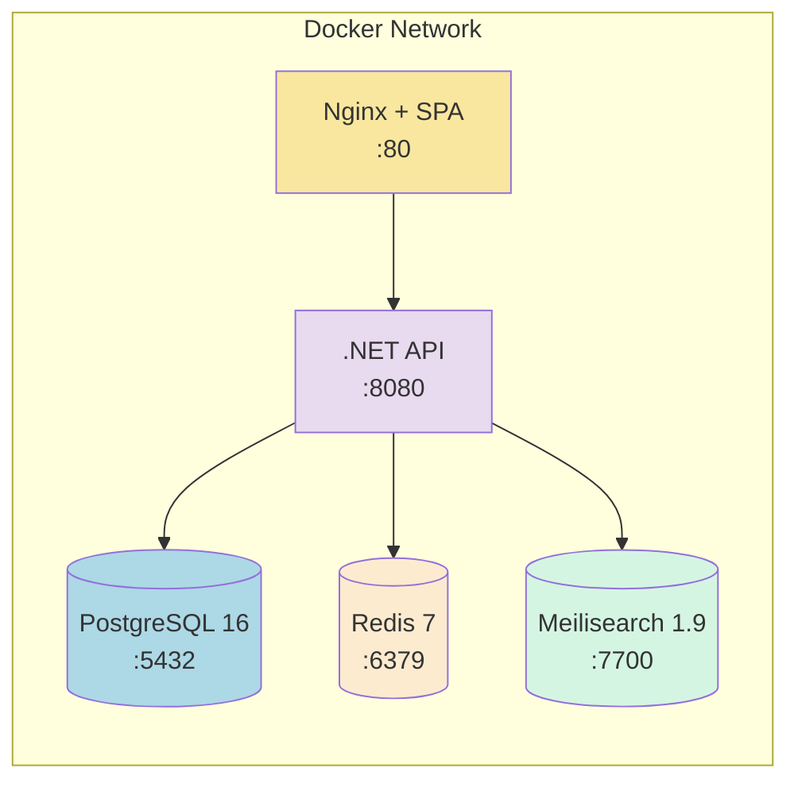

# Docker Compose

> Infrastructure orchestration with 5 services.

---

## Services



| Service | Image | Internal Port | Exposed Port | Depends On |
|---|---|---|---|---|
| `db` | postgres:16-alpine | 5432 | 5432 | — |
| `redis` | redis:7-alpine | 6379 | 6379 | — |
| `meilisearch` | getmeili/meilisearch:v1.9 | 7700 | 7700 | — |
| `api` | custom (Dockerfile) | 8080 | 8080 | db (healthy), redis, meilisearch |
| `web` | custom (Dockerfile) | 80 | 3000 | api |

---

## API Dockerfile

```dockerfile
FROM mcr.microsoft.com/dotnet/aspnet:9.0 AS base
WORKDIR /app
EXPOSE 8080

FROM mcr.microsoft.com/dotnet/sdk:9.0 AS build
WORKDIR /src
COPY ["PainelObrigacoes.Api/PainelObrigacoes.Api.csproj", "PainelObrigacoes.Api/"]
# ... other csproj files
RUN dotnet restore
COPY . .
RUN dotnet publish -c Release -o /app/publish

FROM base AS final
COPY --from=publish /app/publish .
ENTRYPOINT ["dotnet", "PainelObrigacoes.Api.dll"]
```

## Web Dockerfile

```dockerfile
FROM node:20-alpine AS build
WORKDIR /app
COPY package*.json ./
RUN npm ci
COPY . .
RUN npm run build

FROM nginx:alpine
COPY --from=build /app/dist /usr/share/nginx/html
COPY nginx.conf /etc/nginx/conf.d/default.conf
EXPOSE 80
```

## nginx.conf

```nginx
server {
    listen 80;
    root /usr/share/nginx/html;
    index index.html;
    location / { try_files $uri $uri/ /index.html; }
    location /api/ {
        proxy_pass http://api:8080;
        proxy_set_header Host $host;
    }
}
```

---

## Environment Variables

All connection strings are passed via `docker-compose.yml` environment variables:

| Service | Variable | Value |
|---|---|---|
| api | `ConnectionStrings__DefaultConnection` | `Host=db;Port=5432;Database=paineldb;Username=paineluser;Password=painelpass` |
| api | `ConnectionStrings__Redis` | `redis:6379` |
| api | `Meilisearch__Url` | `http://meilisearch:7700` |
| api | `Meilisearch__MasterKey` | `masterKey123` |
| db | `POSTGRES_DB` | `paineldb` |
| db | `POSTGRES_USER` | `paineluser` |
| db | `POSTGRES_PASSWORD` | `painelpass` |
| meilisearch | `MEILI_MASTER_KEY` | `masterKey123` |

---

## Health Checks

PostgreSQL includes a health check to ensure the API only starts after the database is ready:

```yaml
healthcheck:
  test: ["CMD-SHELL", "pg_isready -U paineluser -d paineldb"]
  interval: 5s
  timeout: 5s
  retries: 10
```

---

## Volumes

| Volume | Mount Point | Service |
|---|---|---|
| `pgdata` | `/var/lib/postgresql/data` | db |
| `meilidata` | `/meili_data` | meilisearch |
