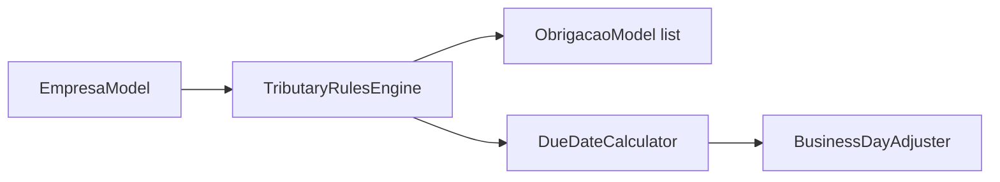
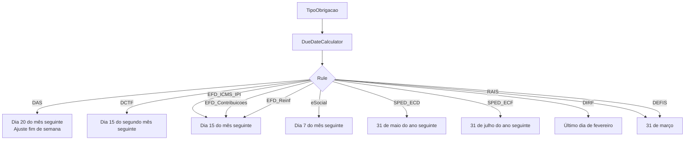
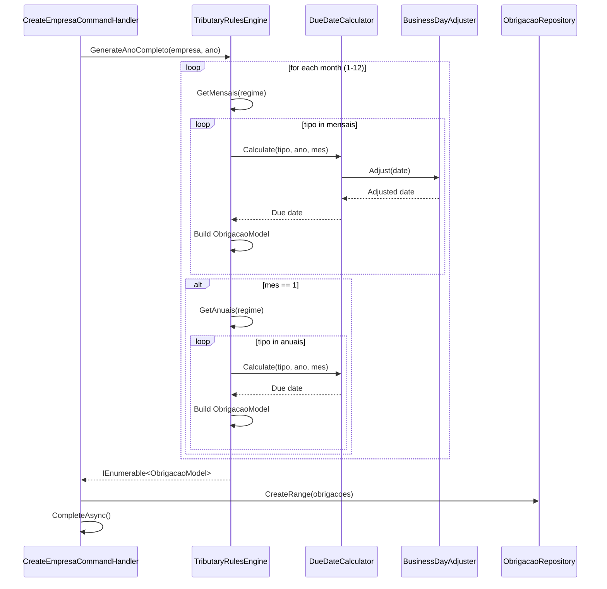

# Tributary Rules Engine

> Domain service that generates accessory obligations based on company tax regime and competency period.

---

## Overview

The `TributaryRulesEngine` is the core domain service responsible for determining which fiscal obligations a company must fulfill based on its tax regime. It uses `DueDateCalculator` to compute precise due dates, applying business day adjustments for weekends.

---

## Decision Matrix

### Monthly Obligations by Regime

| Regime | Monthly Obligations |
|---|---|
| `SimplesNacional` | DAS, eSocial |
| `LucroPresumido` | DCTF, EFD_ICMS_IPI, EFD_Contribuicoes, EFD_Reinf, eSocial |
| `LucroReal` | DCTF, EFD_ICMS_IPI, EFD_Contribuicoes, EFD_Reinf, eSocial |
| `ImunidadeIsencao` | *(none)* |

### Annual Obligations (generated only in January)

| Regime | Annual Obligations |
|---|---|
| `SimplesNacional` | DEFIS, DIRF, RAIS |
| `LucroPresumido` | SPED_ECD, SPED_ECF, DIRF, RAIS |
| `LucroReal` | SPED_ECD, SPED_ECF, DIRF, RAIS |
| `ImunidadeIsencao` | *(none)* |

---

## Due Date Rules

### Detailed Rules

| Tipo | Calculation Rule | Example (2024-01) | Weekend Adjustment |
|---|---|---|---|
| `DAS` | 20th of next month | 2024-02-20 | Yes: Sat→Mon, Sun→Mon |
| `DCTF` | 15th of month+2 | 2024-03-15 | No |
| `EFD_ICMS_IPI` | 15th of next month | 2024-02-15 | No |
| `EFD_Contribuicoes` | 15th of next month | 2024-02-15 | No |
| `EFD_Reinf` | 15th of next month | 2024-02-15 | No |
| `eSocial` | 7th of next month | 2024-02-07 | No |
| `SPED_ECD` | May 31 of next year | 2025-05-31 | No |
| `SPED_ECF` | Jul 31 of next year | 2025-07-31 | No |
| `DIRF` | Last day of Feb next year | 2025-02-28 | No |
| `RAIS` | Mar 31 of next year | 2025-03-31 | No |
| `DEFIS` | Mar 31 of next year | 2025-03-31 | No |

---

## Business Day Adjustment

Weekend fallback logic (`BusinessDayAdjuster`):

| Falls On | Adjusted To |
|---|---|
| Saturday | Monday (+2 days) |
| Sunday | Monday (+1 day) |
| Weekday | Same day |

---

## Tratamento de Obrigações Não Aplicáveis

A engine de regras gera apenas as obrigações **devidas** para cada empresa, conforme o regime tributário informado. Obrigações que não se aplicam ao regime da empresa não são persistidas no banco de dados.

Por exemplo, uma empresa do **Simples Nacional** não terá registros de DCTF, SPED ECD ou SPED ECF no calendário — essas obrigações simplesmente não são geradas pela engine.

### Justificativa

Esta decisão foi tomada para:

1. **Manter o calendário limpo** — exibir apenas obrigações efetivamente devidas reduz ruído visual.
2. **Alinhar ao objetivo do case** — o documento pede visualização de obrigações **devidas** com prazos e status, não uma matriz completa de todas as obrigações possíveis.
3. **Simplificar queries** — dashboard e alertas não precisam filtrar registros "Não Aplicável".

O status `NaoAplicavel` permanece modelado no enum `StatusObrigacao` para uma possível evolução futura, caso seja necessário exibir uma matriz completa de obrigações por regime (ex.: para fins de consulta ou auditoria).

> **Decisão documentada:** ROADMAP.md — linha "NaoAplicavel Status → Not generated".

---

## Geração de Obrigações ao Cadastrar Empresa

Ao cadastrar uma nova empresa, o `CreateEmpresaCommandHandler` gera obrigações **a partir do mês atual** até dezembro, utilizando `ITributaryRulesEngine.GenerateObrigacoes()` em loop.

Isso significa que, se a empresa for cadastrada em junho, apenas obrigações de junho a dezembro serão geradas — **nenhuma competência passada é criada**.

> O `DatabaseSeeder` (seed de demonstração) continua gerando o ano completo intencionalmente, para demonstrar o dashboard com dados de obrigações atrasadas e entregues.

### Justificativa para o escopo do case

1. **Demonstração de dados** — obrigações passadas geram registros "Pendente" ou "Atrasada", enriquecendo o dashboard e o painel de alertas.
2. **Calendário completo** — o usuário pode navegar por todo o ano e ver o planejamento fiscal.
3. **Sem risco fiscal** — o sistema é um painel de controle/consulta, não um sistema de declaração. A geração retroativa não causa multas ou duplicidade.

## Rollover Anual Automático

O `YearRolloverService` (implementado como `IHostedService`) garante que empresas ativas sempre tenham obrigações para o ano corrente:

- Executa **na inicialização** da aplicação
- Verifica cada empresa ativa: se não possui obrigações para o ano corrente, gera o **ano completo** via `GenerateAnoCompleto()`
- Repetido a cada **24 horas** via timer
- Útil quando o sistema fica rodando continuamente e o ano vira (ex.: 31/12 → 01/01)

### Cenário produtivo

Em produção, esta regra poderia evoluir para:

- Aceitar uma **competência inicial** configurável por empresa (ex.: mês de abertura ou mês de adesão ao sistema).
- Oferecer uma tela de "gerar obrigações para o próximo ano" ao invés de gerar automaticamente.

---

## Engine Flow

---

## Key Files

| File | Path |
|---|---|
| `ITributaryRulesEngine` | `Domain/Obrigacoes/Services/ITributaryRulesEngine.cs` |
| `TributaryRulesEngine` | `Domain/Obrigacoes/Services/TributaryRulesEngine.cs` |
| `IDueDateCalculator` | `Domain/Obrigacoes/Services/IDueDateCalculator.cs` |
| `DueDateCalculator` | `Domain/Obrigacoes/Services/DueDateCalculator.cs` |
| `IBusinessDayAdjuster` | `Domain/Obrigacoes/Services/IBusinessDayAdjuster.cs` |
| `BusinessDayAdjuster` | `Domain/Obrigacoes/Services/BusinessDayAdjuster.cs` |
| Tests | `Tests/Domain/Engine/TributaryRulesEngineTests.cs` |
