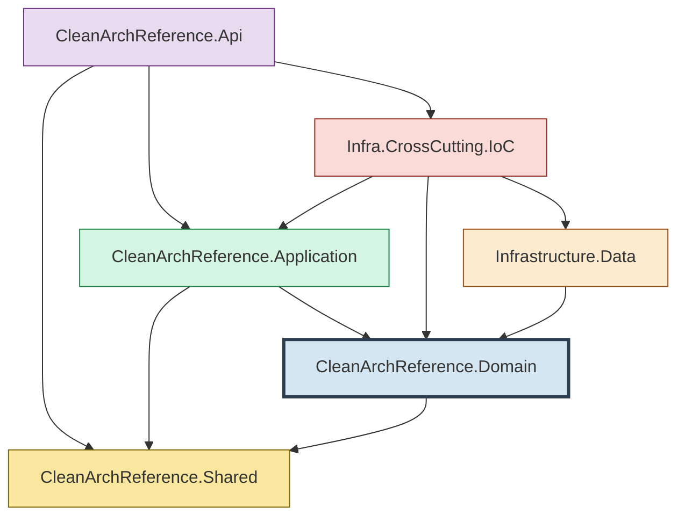
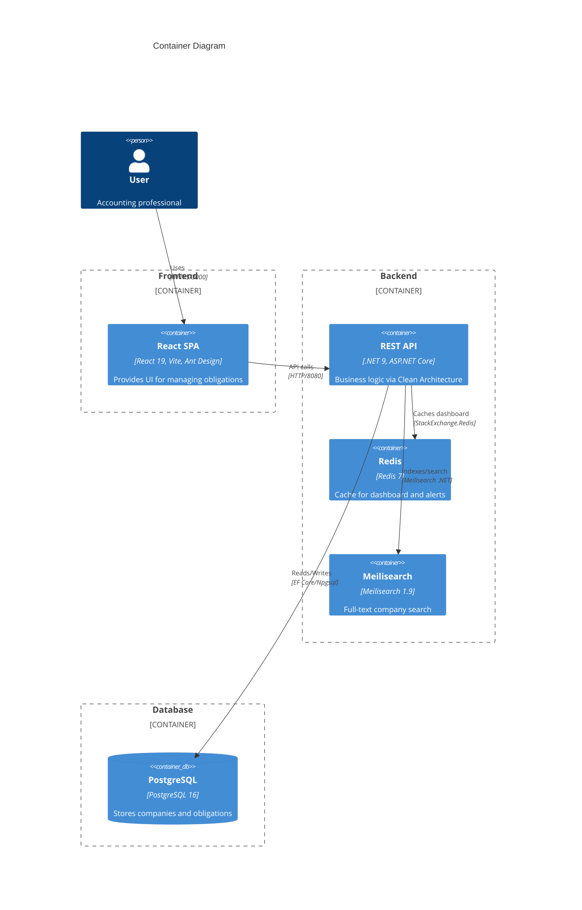
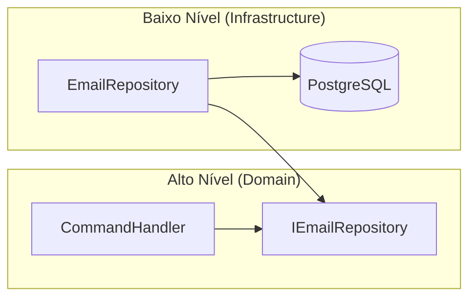
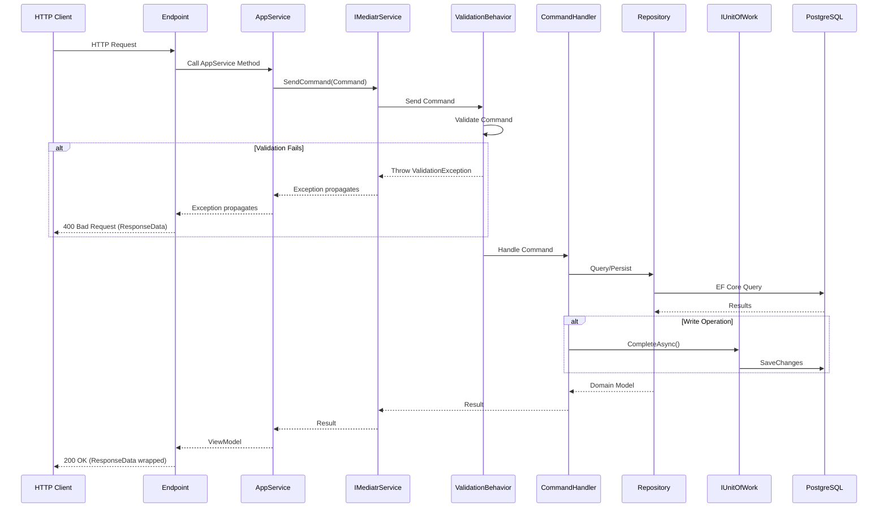
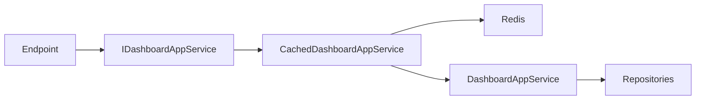
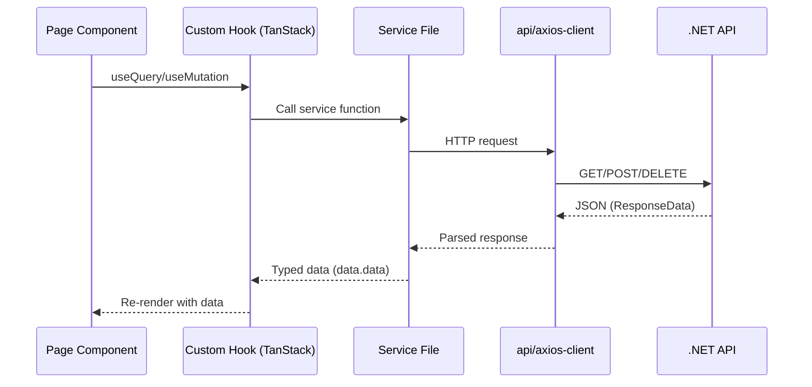
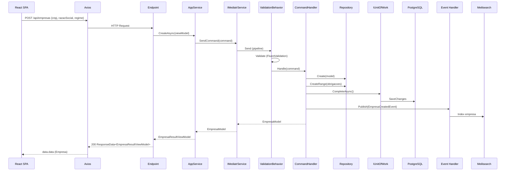
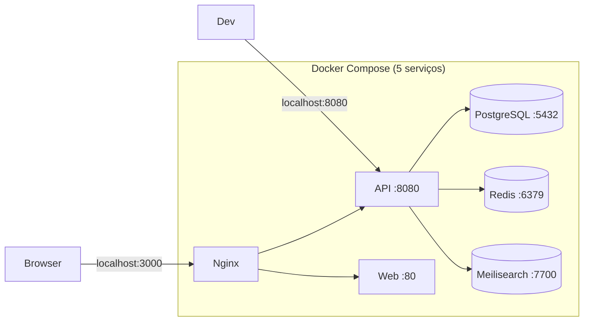

# 🏛️ CleanArchReference — Guia de Estudo Completo

> **Projeto Referência de Estudo — Clean Architecture · Design Patterns · Boas Práticas
> **Stack:** .NET 9 + React 19 + PostgreSQL 16 + Redis + Meilisearch
> **Arquitetura:** Clean Architecture · CQRS · MediatR · EF Core

---

## Índice

1. [Visão Geral do Projeto](#1-visão-geral-do-projeto)
2. [Arquitetura em Camadas (Clean Architecture)](#2-arquitetura-em-camadas-clean-architecture)
3. [SOLID na Prática](#3-solid-na-prática)
4. [CQRS + MediatR](#4-cqrs--mediatr)
5. [Design Patterns Utilizados](#5-design-patterns-utilizados)
6. [Backend — Camada por Camada](#6-backend--camada-por-camada)
7. [Frontend — Feature-Based Architecture](#7-frontend--feature-based-architecture)
8. [Fluxo Completo de uma Requisição](#8-fluxo-completo-de-uma-requisição)
9. [Domain Services — TributaryRulesEngine](#9-domain-services--tributaryrulesengine)
10. [Infraestrutura — Docker Compose](#10-infraestrutura--docker-compose)
11. [Segurança](#11-segurança)
12. [Testes](#12-testes)
13. [Glossário Técnico](#13-glossário-técnico)

---

## 1. Visão Geral do Projeto

### O que é?

O **CleanArchReference (Painel de Obrigações Acessórias)** é um sistema web que substitui planilhas frágeis no gerenciamento de obrigações fiscais acessórias brasileiras. Ele gerencia múltiplas empresas com diferentes regimes tributários, gera obrigações automaticamente com base em regras fiscais, calcula datas de vencimento com ajuste de dias úteis, rastreia status de entrega e emite alertas sobre prazos futuros ou vencidos.

### Features Implementadas

| Feature | Descrição |
|---------|-----------|
| **CRUD de Empresas** | Cadastro, listagem, soft delete com validação de CNPJ |
| **4 Regimes Tributários** | Simples Nacional, Lucro Presumido, Lucro Real, Imunidade/Isenção |
| **Geração Automática de Obrigações** | 12 meses de obrigações geradas no cadastro da empresa |
| **Cálculo de Vencimentos** | Ajuste para dia útil quando cai em fim de semana |
| **Calendário** | Filtro por empresa, mês, ano e status |
| **Registro de Entrega** | Marcar obrigações como entregues |
| **Dashboard** | Estatísticas consolidadas (totais, pendentes, entregues, atrasadas) |
| **Painel de Alertas** | 30 dias de lookahead + obrigações atrasadas |
| **Redis Cache** | Dashboard e Alertas com TTL |
| **Meilisearch** | Busca full-text de empresas com typo tolerance |
| **Exportação** | CSV, XLSX, PDF (QuestPDF) |
| **Year Rollover** | Geração automática de obrigações do novo ano |

### Stack Completa

```
Backend:  .NET 9, ASP.NET Core 9, EF Core 9, Npgsql
          MediatR 12, FluentValidation 11, AutoMapper 13
          StackExchange.Redis, Meilisearch .NET Client
          QuestPDF, CsvHelper, EPPlus

Frontend: React 19, Vite 6, TypeScript 5
          Ant Design 5, TanStack Query 5, Axios
          Dayjs, React Router

Testing:  xUnit, Moq, FluentAssertions (backend)
          Vitest, React Testing Library, MSW (frontend)

Infra:    Docker Compose, PostgreSQL 16 Alpine
          Redis 7 Alpine, Meilisearch 1.9
          Nginx (SPA serve + proxy reverso)
```

---

## 2. Arquitetura em Camadas (Clean Architecture)

### Por que Clean Architecture?

A Clean Architecture foi escolhida para garantir:

1. **Independência de frameworks** — O Domain não sabe que usa EF Core ou ASP.NET
2. **Testabilidade** — Regras de negócio testáveis sem infraestrutura
3. **Separação de responsabilidades** — Cada camada tem um papel bem definido
4. **Flexibilidade** — Trocar PostgreSQL por SQL Server não afeta regras de negócio

### Os 6 Projetos da Solução

```
CleanArchReference.slnx
├── 📁 Domain                    # Coração do sistema (0 dependências)
├── 📁 Application               # Casos de uso e ViewModels
├── 📁 Infrastructure.Data       # EF Core, Repositories, Migrations
├── 📁 Infrastructure.CrossCutting.IoC  # DI Composition Root
├── 📁 Api                       # Endpoints Minimal API, Middleware
└── 📁 Shared                    # ResponseData envelope
```

### Diagrama de Dependências



**Regra de Ouro:** Domain NÃO referencia nenhum outro projeto. As setas apontam para dentro.

### Diagrama de Camadas (C4 Container)



### Organização por Feature

Cada feature (Empresa, Obrigação, Dashboard) tem pastas espelhadas em todas as camadas:

```
Domain/Empresas/
├── Commands/           → CreateEmpresaCommand.cs
├── Queries/            → FindEmpresasQuery.cs
├── CommandHandlers/    → CreateEmpresaCommandHandler.cs
├── QueryHandlers/      → FindEmpresasQueryHandler.cs
├── Models/             → EmpresaModel.cs
├── Repositories/       → IEmpresaRepository.cs
├── Services/           → Interfaces de serviços de domínio
├── Validations/        → CreateEmpresaCommandValidation.cs
└── Events/             → EmpresaCreatedEvent.cs

Application/Empresas/
├── ViewModels/         → CreateEmpresaViewModel.cs, EmpresaResultViewModel.cs
├── Services/           → IEmpresaAppService.cs, EmpresaAppService.cs
└── AutoMapper/         → EmpresaProfile.cs

Infrastructure.Data/Empresas/
└── Repositories/       → EmpresaRepository.cs
```

---

## 3. SOLID na Prática

### S — Single Responsibility Principle

Cada classe tem **uma única responsabilidade**:

| Classe | Responsabilidade |
|--------|-----------------|
| `CreateEmpresaCommand` | Dados da intenção de criar empresa |
| `CreateEmpresaCommandHandler` | Executar a lógica de criação |
| `CreateEmpresaCommandValidation` | Validar dados do comando |
| `EmpresaRepository` | Acesso a dados de empresa |
| `ExceptionMiddleware` | Capturar e formatar exceções |
| `EmpresaAppService` | Orquestrar fluxo ViewModel → Command → Handler |

### O — Open/Closed Principle

Classes abertas para extensão, fechadas para modificação:

- **ValidationBehavior** — Pipeline behavior do MediatR adiciona validação sem modificar handlers
- **Decorator Pattern (CachedDashboardAppService)** — Adiciona cache sem modificar o `DashboardAppService` original
- **ITributaryRulesEngine** — Interface permite diferentes implementações de regras fiscais
- **IBusinessDayAdjuster** — Pode ser estendido para feriados municipais/estaduais

### L — Liskov Substitution Principle

Todas as implementações de interfaces podem ser substituídas sem quebrar o sistema:

```csharp
// Domain define a interface
public interface IEmpresaRepository { ... }

// Infrastructure.Data implementa
public sealed class EmpresaRepository : IEmpresaRepository { ... }

// O handler depende da interface, não da implementação
public sealed class CreateEmpresaCommandHandler
{
    private readonly IEmpresaRepository _empresaRepository;
    // ...
}
```

### I — Interface Segregation Principle

Interfaces pequenas e coesas:

```csharp
// Cada repositório tem apenas os métodos que precisa
public interface IEmpresaRepository
{
    Task<EmpresaModel?> FindByIdAsync(Guid id);
    Task<IList<EmpresaModel>> FindAllAsync(int skip, int take);
    Task<bool> ExistsByCnpjAsync(string cnpj);
    void Create(EmpresaModel model);
    void Delete(EmpresaModel model);
}

// IMediatrService expõe apenas SendCommand e SendQuery
public interface IMediatrService
{
    Task<TResult> SendCommand<TResult>(Command<TResult> command, CancellationToken ct);
    Task<TResult> SendQuery<TResult>(Query<TResult> query, CancellationToken ct);
}
```

### D — Dependency Inversion Principle

Módulos de alto nível não dependem de módulos de baixo nível. Ambos dependem de abstrações.



**Exemplo real:** `CreateEmpresaCommandHandler` depende de `IEmpresaRepository` (definido no Domain), não de `EmpresaRepository` (implementado em Infrastructure.Data).

---

## 4. CQRS + MediatR

### O que é CQRS?

**CQRS = Command Query Responsibility Segregation**

- **Commands (Comandos)** — Operações que **alteram estado** (Create, Update, Delete)
- **Queries (Consultas)** — Operações que **retornam dados** sem efeitos colaterais

### Estrutura

```csharp
// Base classes (Domain/Shared)
public abstract class Command<TResult> : IRequest<TResult> { }  // → Write
public abstract class Query<TResult> : IRequest<TResult> { }     // → Read
```

### Tabela de Nomenclatura

| Operação | Base Class | Pasta | Handler |
|----------|-----------|-------|---------|
| Criar empresa | `Command<EmpresaModel>` | `Commands/` | `CommandHandlers/` |
| Deletar empresa | `Command<bool>` | `Commands/` | `CommandHandlers/` |
| Listar empresas | `Query<IList<EmpresaModel>>` | `Queries/` | `QueryHandlers/` |
| Buscar dashboard | `Query<DashboardData>` | `Queries/` | `QueryHandlers/` |

### Exemplo Prático: Criar Empresa

```csharp
// 1. COMMAND — contém os dados necessários
public sealed class CreateEmpresaCommand : Command<EmpresaModel>
{
    public string CNPJ { get; set; }
    public string RazaoSocial { get; set; }
    public RegimeTributario Regime { get; set; }

    public EmpresaModel ToModel() => new()
    {
        CNPJ = CNPJ.Replace(".", "").Replace("/", "").Replace("-", ""),
        RazaoSocial = RazaoSocial.Trim(),
        Regime = Regime
    };
}

// 2. HANDLER — executa a lógica de negócio
public sealed class CreateEmpresaCommandHandler
    : IRequestHandler<CreateEmpresaCommand, EmpresaModel>
{
    private readonly IUnitOfWork _unitOfWork;
    private readonly IEmpresaRepository _empresaRepository;
    // ... outras dependências

    public async Task<EmpresaModel> Handle(CreateEmpresaCommand command, CancellationToken ct)
    {
        // Validação de negócio (CNPJ duplicado)
        if (await _empresaRepository.ExistsByCnpjAsync(cnpjLimpo))
            throw new InvalidOperationException("CNPJ já cadastrado.");

        var model = command.ToModel();
        _empresaRepository.Create(model);

        // Gera obrigações do mês atual até dezembro
        for (int mes = _clock.CurrentMonth; mes <= 12; mes++)
            _obrigacaoRepository.CreateRange(_rulesEngine.GenerateObrigacoes(model, _clock.CurrentYear, mes));

        await _unitOfWork.CompleteAsync(ct);

        // Publica evento de domínio para side effects
        await _mediator.Publish(new EmpresaCreatedEvent(...), ct);

        return model;
    }
}

// 3. VALIDATOR — validação automática via FluentValidation
public sealed class CreateEmpresaCommandValidation : AbstractValidator<CreateEmpresaCommand>
{
    public CreateEmpresaCommandValidation()
    {
        RuleFor(c => c.CNPJ).NotEmpty().Matches(@"^\d{14}$|^\d{2}\.\d{3}\.\d{3}\/\d{4}-\d{2}$");
        RuleFor(c => c.RazaoSocial).NotEmpty().MaximumLength(300);
        RuleFor(c => c.Regime).IsInEnum();
    }
}
```

### Pipeline Validation

O **ValidationBehavior** é um `IPipelineBehavior` do MediatR que roda **antes** do handler:



### Domain Events (INotification)

Eventos para **side effects** (indexar no Meilisearch, invalidar cache):

```csharp
// Evento (Domain)
public sealed record EmpresaCreatedEvent(
    Guid EmpresaId, string CNPJ, string RazaoSocial, RegimeTributario Regime)
    : INotification;

// Handler (Infrastructure.Data)
public sealed class EmpresaCreatedHandler : INotificationHandler<EmpresaCreatedEvent>
{
    public async Task Handle(EmpresaCreatedEvent notification, CancellationToken ct)
    {
        // Indexa no Meilisearch
        await _searchService.IndexAsync(notification);
    }
}
```

---

## 5. Design Patterns Utilizados

| Pattern | Onde? | Por quê? |
|---------|-------|----------|
| **Mediator** | MediatR | Desacopla quem envia (AppService) de quem processa (Handler) |
| **CQRS** | Commands vs Queries | Separa reads de writes |
| **Repository** | IEmpresaRepository, EmpresaRepository | Abstrai o armazenamento |
| **Unit of Work** | IUnitOfWork, UnitOfWork | Transação única, handlers nunca chamam SaveChanges |
| **Decorator** | CachedDashboardAppService | Adiciona cache sem modificar a classe original |
| **Facade** | AppServices | Interface simplificada entre endpoints e handlers |
| **Pipeline Behavior** | ValidationBehavior | Cross-cutting no pipeline do MediatR |
| **Observer/Event** | INotification + EventHandlers | Side effects desacoplados |
| **Strategy** | TributaryRulesEngine | Algoritmos de geração por regime tributário |
| **Dependency Injection** | ProjectBootstrapper | Inversão de controle |
| **AutoMapper** | EmpresaProfile | Mapeamento ViewModel ↔ Domain Model |

### Decorator Pattern — CachedDashboardAppService



```csharp
// IoC registra o decorator
services.AddScoped<DashboardAppService>();  // Real
services.AddScoped<IDashboardAppService>(sp =>
    new CachedDashboardAppService(
        sp.GetRequiredService<DashboardAppService>(),
        sp.GetRequiredService<IDistributedCache>()));
```

### Repository + Unit of Work

```csharp
// Domain — Interface
public interface IEmpresaRepository
{
    Task<EmpresaModel?> FindByIdAsync(Guid id);
    void Create(EmpresaModel model);
}

// Domain — Interface
public interface IUnitOfWork
{
    Task CompleteAsync(CancellationToken cancellationToken = default);
}

// Infrastructure.Data — Implementação do Repository
public sealed class EmpresaRepository : IEmpresaRepository
{
    private readonly AppDbContext _context;

    public void Create(EmpresaModel model)
        => _context.Empresas.Add(ToEntity(model));

    // NUNCA chama SaveChanges aqui — isso é do UoW
}

// Handler orquestra
public async Task<EmpresaModel> Handle(CreateEmpresaCommand command, CancellationToken ct)
{
    _empresaRepository.Create(model);
    _obrigacaoRepository.CreateRange(obrigacoes);
    await _unitOfWork.CompleteAsync(ct); // Único SaveChanges
    return model;
}
```

---

## 6. Backend — Camada por Camada

### Domain (Coração)

**Dependências:** Zero (nenhuma referência a outro projeto)

**O que contém:**

```
Domain/
├── Empresas/
│   ├── Commands/          → CreateEmpresaCommand, DeleteEmpresaCommand
│   ├── Queries/           → FindEmpresasQuery, SearchEmpresasQuery
│   ├── CommandHandlers/   → CreateEmpresaCommandHandler
│   ├── QueryHandlers/     → FindEmpresasQueryHandler
│   ├── Models/            → EmpresaModel (entidade de domínio)
│   ├── Repositories/      → IEmpresaRepository (interface apenas)
│   ├── Validations/       → CreateEmpresaCommandValidation
│   ├── Events/            → EmpresaCreatedEvent, EmpresaDeletedEvent
│   └── Services/          → Interfaces de serviços
├── Obrigacoes/
│   ├── Models/            → ObrigacaoModel
│   ├── Repositories/      → IObrigacaoRepository
│   └── Services/          → ITributaryRulesEngine, IDueDateCalculator...
├── Dashboard/             → Queries e Models do dashboard
├── Enums/                 → RegimeTributario, TipoObrigacao, StatusObrigacao
├── Shared/
│   ├── Commands/          → Command<TResult> base
│   ├── Queries/           → Query<TResult> base
│   ├── Models/            → ModelBase
│   ├── Interfaces/        → IMediatrService, IUnitOfWork, IDateTimeProvider
│   └── Behaviors/         → ValidationBehavior
```

**Regras:**
- ❌ NÃO pode referenciar Application, Infrastructure ou HTTP
- ✅ Commands/Queries/Handlers/Validators ficam juntos por feature

### Application

**Dependências:** Domain, Shared

```
Application/
├── Empresas/
│   ├── ViewModels/        → CreateEmpresaViewModel, EmpresaResultViewModel
│   ├── Services/          → IEmpresaAppService, EmpresaAppService
│   └── AutoMapper/        → EmpresaProfile
├── Obrigacoes/
│   └── ...
└── Dashboard/
    └── ...
```

**AppService — o Facade:**

```csharp
public sealed class EmpresaAppService : IEmpresaAppService
{
    private readonly IMediatrService _mediator;
    private readonly IMapper _mapper;

    public async Task<EmpresaResultViewModel> CreateAsync(CreateEmpresaViewModel vm, CancellationToken ct)
    {
        // 1. Mapeia ViewModel → Command
        var command = _mapper.Map<CreateEmpresaCommand>(vm);
        // 2. Envia via MediatR (passa pelo ValidationBehavior)
        var model = await _mediator.SendCommand(command, ct);
        // 3. Mapeia Model → ViewModel de resultado
        return _mapper.Map<EmpresaResultViewModel>(model);
    }
}
```

### Infrastructure.Data

**Dependências:** Domain

```
Infrastructure.Data/
├── Context/               → AppDbContext, UnitOfWork
├── Entities/              → EmpresaEntity, ObrigacaoEntity, EntityBase
├── Configurations/        → EmpresaConfiguration, ObrigacaoConfiguration (Fluent API)
├── Empresas/Repositories/ → EmpresaRepository
├── Obrigacoes/Repositories/ → ObrigacaoRepository
├── Events/                → EmpresaCreatedHandler, ObrigacaoEntregueHandler
├── Search/                → MeilisearchEmpresaService, MeilisearchIndexSetup
├── Services/              → YearRolloverService, DateTimeProvider
├── Migrations/            → EF Core migrations
└── Seed/                  → DatabaseSeeder
```

**Repository — mapeamento Entity ↔ Model:**

```csharp
public sealed class EmpresaRepository : IEmpresaRepository
{
    public async Task<EmpresaModel?> FindByIdAsync(Guid id)
    {
        var entity = await _context.Empresas.AsNoTracking()
            .FirstOrDefaultAsync(e => e.Id == id);
        return entity is null ? null : ToModel(entity);
    }

    public void Create(EmpresaModel model)
    {
        var entity = ToEntity(model);
        _context.Empresas.Add(entity);
        model.Id = entity.Id; // Sincroniza ID gerado
    }

    private static EmpresaModel ToModel(EmpresaEntity e) => new()
    {
        Id = e.Id, CNPJ = e.CNPJ, RazaoSocial = e.RazaoSocial, ...
    };

    private static EmpresaEntity ToEntity(EmpresaModel m) => new()
    {
        Id = m.Id, CNPJ = m.CNPJ, RazaoSocial = m.RazaoSocial, ...
    };
}
```

### Infrastructure.CrossCutting.IoC

**Dependências:** Domain, Application, Infrastructure.Data

**Composition Root** — tudo é registrado aqui:

```csharp
public static IServiceCollection RegisterServices(this IServiceCollection services, IConfiguration cfg)
{
    // EF Core
    services.AddDbContext<AppDbContext>(options =>
        options.UseNpgsql(cfg.GetConnectionString("DefaultConnection")));

    // Redis
    services.AddStackExchangeRedisCache(options =>
        options.Configuration = cfg.GetConnectionString("Redis"));

    // Meilisearch
    services.AddSingleton(new MeilisearchClient(meiliUrl, meiliKey));

    // Domain Services
    services.AddScoped<IUnitOfWork, UnitOfWork>();
    services.AddScoped<IMediatrService, MediatrService>();

    // MediatR + ValidationBehavior
    services.AddMediatR(cfg => {
        cfg.RegisterServicesFromAssemblies(domainAssembly, infraAssembly);
        cfg.AddBehavior(typeof(IPipelineBehavior<,>), typeof(ValidationBehavior<,>));
    });
    services.AddValidatorsFromAssembly(domainAssembly);
    services.AddAutoMapper(applicationAssembly);

    // Feature registrations
    services.AddEmpresaFeature().AddObrigacaoFeature().AddDashboardFeature();
}
```

### Api

**Dependências:** Application, IoC, Shared

```csharp
// Program.cs
var builder = WebApplication.CreateBuilder(args);

// Configurações: Kestrel, Swagger, CORS, Rate Limiting, Health Checks
builder.Services.RegisterServices(builder.Configuration);

var app = builder.Build();

// Middleware pipeline
app.UseCors("AllowedOrigins");
app.UseMiddleware<SecurityHeadersMiddleware>();
app.UseMiddleware<ExceptionMiddleware>();
app.UseRateLimiter();

// Endpoints (Minimal API)
app.MapEmpresasEndpoints();
app.MapObrigacoesEndpoints();
app.MapDashboardEndpoints();
app.MapHealthChecks("/health");

// Migration + Seed
await using (var scope = app.Services.CreateScope())
{
    var db = scope.ServiceProvider.GetRequiredService<AppDbContext>();
    db.Database.Migrate();
    await DatabaseSeeder.SeedAsync(scope.ServiceProvider);
}

app.Run();
```

**Endpoint Pattern:**

```csharp
public static IEndpointRouteBuilder MapEmpresasEndpoints(this IEndpointRouteBuilder app)
{
    var group = app.MapGroup("/api/empresas").WithTags("Empresas");

    group.MapGet("/", async (int skip = 0, int take = 50,
            IEmpresaAppService appService, CancellationToken ct) =>
        {
            var result = await appService.FindAllAsync(skip, take, ct);
            return result.ToOkResponse();  // → ResponseData envelope
        })
        .WithName("FindAllEmpresas")
        .Produces<ResponseData<IList<EmpresaResultViewModel>>>(StatusCodes.Status200OK);

    return app;
}
```

### Shared

**Dependências:** Nenhuma

```csharp
public class ResponseData<T>
{
    public bool Success { get; set; }
    public string Message { get; set; }
    public T? Data { get; set; }
    public ResponseErrorCode? ErrorCode { get; set; }

    public static ResponseData<T> Ok(T data, string message = "")
        => new() { Success = true, Message = message, Data = data };

    public static ResponseData<T> Fail(string message, ResponseErrorCode errorCode)
        => new() { Success = false, Message = message, ErrorCode = errorCode };
}
```

**Error Codes vs HTTP Status:**

| ErrorCode | HTTP Status | Causa |
|-----------|-------------|-------|
| `null` | 200 | Sucesso |
| `Validation` | 400 | FluentValidation |
| `NotFound` | 404 | KeyNotFoundException |
| `Conflict` | 409 | InvalidOperationException |
| `InternalError` | 500 | Exception não tratada |

---

## 7. Frontend — Feature-Based Architecture

### Estrutura de Pastas

```
src/
├── infrastructure/http/    → axios-client.ts (instância Axios + interceptors)
├── application/services/   → empresa.service.ts, obrigacao.service.ts...
├── hooks/                  → useEmpresas.ts, useDashboard.ts...
├── pages/                  → DashboardPage, EmpresasPage, CalendarioPage
├── components/
│   ├── ui/                 → StatusBadge, RegimeBadge, PageHeader...
│   ├── empresa/            → EmpresaTable, EmpresaForm, EmpresaFilters...
│   ├── dashboard/          → KpiGrid, AlertasTable, AlertasChart...
│   └── calendario/         → ObrigacaoTable, CalendarFilters, ExportButton
├── domain/types/           → Empresa, Obrigacao, DashboardData...
├── shared/                 → BaseService, ApiResponse, utils
├── lib/                    → query-keys.ts (key factories)
├── context/                → ThemeContext (dark/light)
└── theme/                  → antd.ts (tema Ant Design customizado)
```

### Fluxo de Dados

```
Page → Hook (TanStack Query) → Service → api/axios → API
```



### Service Layer (BaseService)

```typescript
export abstract class BaseService<TEntity, TCreate = never, TUpdate = never> {
  protected abstract readonly resource: string;

  constructor(protected readonly client: AxiosInstance) {}

  async getAll(): Promise<TEntity[]> {
    const { data } = await this.client.get<ApiResponse<TEntity[]>>(this.resource);
    return data.data; // Extrai o envelope ResponseData
  }

  async create(payload: TCreate): Promise<TEntity> {
    const { data } = await this.client.post<ApiResponse<TEntity>>(this.resource, payload);
    return data.data;
  }

  async remove(id: string): Promise<void> {
    await this.client.delete(`${this.resource}/${id}`);
  }
}

// Uso concreto
class EmpresaService extends BaseService<Empresa, CreateEmpresaPayload> {
  protected readonly resource = '/api/empresas';

  async search(q: string): Promise<Empresa[]> {
    return this.getRequest<Empresa[]>(`${this.resource}/search`, { params: { q } });
  }
}

export const empresaService = new EmpresaService(api);
```

### Hooks (TanStack Query)

```typescript
// hooks/useEmpresas.ts
export function useEmpresas() {
  return useQuery({
    queryKey: empresasKeys.all,  // ['empresas']
    queryFn: () => empresaService.getAll(),
    staleTime: 1000 * 60 * 2,   // 2 min sem refetch
  });
}

export function useCreateEmpresa() {
  const qc = useQueryClient();
  return useMutation({
    mutationFn: (payload: CreateEmpresaPayload) => empresaService.create(payload),
    onSuccess: () => qc.invalidateQueries({ queryKey: empresasKeys.all }),
  });
}
```

### Query Key Factories

```typescript
// lib/query-keys.ts
export const empresasKeys = {
  all: ['empresas'] as const,
  search: (q: string) => ['empresas', 'search', q] as const,
};

export const obrigacoesKeys = {
  all: ['obrigacoes'] as const,
  list: (params: FindObrigacoesParams) =>
    ['obrigacoes', params.empresaId, params.ano, params.mes] as const,
  historico: (empresaId: string) => ['historico', empresaId] as const,
};

export const dashboardKeys = {
  dashboard: (ano: number, mes: number) => ['dashboard', ano, mes] as const,
  alertas: ['alertas'] as const,
};
```

### Page (Composição)

```typescript
function EmpresasPage() {
  const [modalOpen, setModalOpen] = useState(false);
  const { data: empresas = [], isLoading } = useEmpresas();
  const { mutate: deletar } = useDeleteEmpresa();
  const { data: searchResults = [] } = useEmpresaSearch(debouncedQuery);

  return (
    <>
      <PageHeader title="Empresas" subtitle={`${empresas.length} empresa(s) cadastrada(s)`}
        actions={<Button onClick={() => setModalOpen(true)}>Nova Empresa</Button>} />
      <EmpresaFilters onSearch={handleSearch} />
      <EmpresaTable data={displayData} loading={displayLoading}
        onDelete={(id) => deletar(id)} />
      <EmpresaForm open={modalOpen} onClose={() => setModalOpen(false)} />
    </>
  );
}
```

---

## 8. Fluxo Completo de uma Requisição

### Exemplo: Criar uma Empresa

```
1. Frontend: EmpresasPage → useCreateEmpresa() → empresaService.create(payload)
2. Axios:   POST /api/empresas { cnpj, razaoSocial, regime }
3. API:     EmpresasEndpoints.CreateEmpresaAsync
4. AppService: EmpresaAppService.CreateAsync
5. AutoMapper: CreateEmpresaViewModel → CreateEmpresaCommand
6. MediatrService: SendCommand(command)
7. ValidationBehavior: Executa FluentValidation automaticamente
8. CommandHandler: CreateEmpresaCommandHandler.Handle
9. Repository: _empresaRepository.Create(model)
10. Rules Engine: _rulesEngine.GenerateObrigacoes() para meses restantes
11. Repository: _obrigacaoRepository.CreateRange(obrigacoes)
12. UnitOfWork: _unitOfWork.CompleteAsync() → SaveChanges
13. Domain Event: _mediator.Publish(new EmpresaCreatedEvent(...))
14. Event Handler: EmpresaCreatedHandler → Indexa no Meilisearch
15. Response: EmpresaModel → AutoMapper → EmpresaResultViewModel → ResponseData → JSON
```



---

## 9. Domain Services — TributaryRulesEngine

### O que é?

Engine de domínio puro que gera obrigações acessórias com base no **regime tributário** e **período de competência**. Usa `DueDateCalculator` para calcular datas de vencimento com ajuste de dias úteis.

### Matriz de Decisão

| Regime | Obrigações Mensais | Obrigações Anuais (Janeiro) |
|--------|-------------------|---------------------------|
| **Simples Nacional** | DAS, eSocial | DEFIS, DIRF, RAIS |
| **Lucro Presumido** | DCTF, EFD_ICMS_IPI, EFD_Contribuicoes, EFD_Reinf, eSocial | SPED_ECD, SPED_ECF, DIRF, RAIS |
| **Lucro Real** | DCTF, EFD_ICMS_IPI, EFD_Contribuicoes, EFD_Reinf, eSocial | SPED_ECD, SPED_ECF, DIRF, RAIS |
| **Imunidade/Isenção** | *(nenhuma)* | *(nenhuma)* |

### Regras de Vencimento

| Tipo | Regra | Ajuste Fim de Semana |
|------|-------|---------------------|
| DAS | Dia 20 do mês seguinte | ✅ Sim |
| DCTF | Dia 15 do segundo mês seguinte | ❌ Não |
| EFD_ICMS_IPI | Dia 15 do mês seguinte | ❌ Não |
| EFD_Contribuicoes | Dia 15 do mês seguinte | ❌ Não |
| EFD_Reinf | Dia 15 do mês seguinte | ❌ Não |
| eSocial | Dia 7 do mês seguinte | ❌ Não |
| SPED_ECD | 31 de maio do ano seguinte | ❌ Não |
| SPED_ECF | 31 de julho do ano seguinte | ❌ Não |
| DIRF | Último dia de fevereiro | ❌ Não |
| RAIS | 31 de março | ❌ Não |
| DEFIS | 31 de março | ❌ Não |

### BusinessDayAdjuster

```csharp
public sealed class BusinessDayAdjuster : IBusinessDayAdjuster
{
    public DateTime Adjust(DateTime date)
    {
        return date.DayOfWeek switch
        {
            DayOfWeek.Saturday => date.AddDays(2),  // Sábado → Segunda
            DayOfWeek.Sunday   => date.AddDays(1),  // Domingo → Segunda
            _                  => date              // Dia útil → mantém
        };
    }
}
```

### YearRolloverService

`IHostedService` que roda na inicialização e a cada 24h para garantir que empresas ativas tenham obrigações para o ano corrente.

```csharp
public sealed class YearRolloverService : IHostedService, IDisposable
{
    public async Task StartAsync(CancellationToken ct)
    {
        await RolloverAsync(ct);
        _timer = new Timer(async _ => await RolloverAsync(ct), null,
            TimeSpan.FromHours(24), TimeSpan.FromHours(24));
    }

    private async Task RolloverAsync(CancellationToken ct)
    {
        // Verifica cada empresa ativa: se não tem obrigações para o ano corrente,
        // gera o ano completo via GenerateAnoCompleto()
    }
}
```

---

## 10. Infraestrutura — Docker Compose



| Serviço | Imagem | Porta | Saúde |
|---------|--------|-------|-------|
| `db` | postgres:16-alpine | 5432 | `pg_isready` |
| `redis` | redis:7-alpine | 6379 | — |
| `meilisearch` | getmeili/meilisearch:v1.9 | 7700 | — |
| `api` | custom Dockerfile | 8080 | depends_on db (healthy) |
| `web` | custom Dockerfile | 80 → 3000 | depends_on api |

### Nginx como Proxy Reverso

```nginx
server {
    listen 80;
    root /usr/share/nginx/html;
    index index.html;
    location / { try_files $uri $uri/ /index.html; }
    location /api/ {
        proxy_pass http://api:8080;
        proxy_set_header Host $host;
    }
}
```

O Nginx serve o SPA React e faz proxy reverso para `/api/` → API .NET.

---

## 11. Segurança

### Implementado

| Medida | Detalhes |
|--------|----------|
| **Rate Limiting** | 100 req/min global, 5 req/min export |
| **Security Headers** | 7 headers (X-Content-Type-Options, X-Frame-Options, etc.) |
| **CORS** | Restrito a `localhost:5173` e `localhost:3000` |
| **Nginx HTTPS** | Self-signed cert + HSTS + HTTP→HTTPS redirect |
| **DDoS** | 3 camadas: Nginx (limit_conn/limit_req), Kestrel (MaxBodySize 1MB), Docker (CPU/mem limits) |
| **CSV Injection** | Prefixa `=`, `+`, `-`, `@` com `\t` |
| **Exception Middleware** | Mensagens genéricas em produção, detalhes em dev |
| **Cache Invalidation** | Domain events invalidam cache do Redis |

### Intencionalmente Omitido (para o case)

- ❌ **Autenticação JWT** — Não era requisito do Projeto Referência de Estudo — Clean Architecture · Design Patterns · Boas Práticas
- ❌ **CSRF** — Não há cookies de sessão
- ❌ **Secrets Management** — Credenciais no docker-compose (aceitável para demonstração)
- ❌ **Multi-tenant** — Sistema de empresa única

---

## 12. Testes

### Backend — xUnit + Moq + FluentAssertions

```bash
dotnet test src/api/CleanArchReference.Tests/CleanArchReference.Tests.csproj
```

**Estrutura:**

```
Tests/
├── Domain/
│   ├── Engine/         → TributaryRulesEngineTests, DueDateCalculatorTests
│   └── Empresas/       → CreateEmpresaCommandHandlerTests (happy path + errors)
├── Application/
│   └── Empresas/       → EmpresaAppServiceTests
├── Infrastructure.Data/
├── Infrastructure.Services/
├── Api/
└── Shared/
```

**Padrão de Teste:**

```csharp
// Arrange
var command = new CreateEmpresaCommand { CNPJ = "11222333000181", ... };
var handler = new CreateEmpresaCommandHandler(mockUoW, mockRepo, ...);

// Act
var result = await handler.Handle(command, CancellationToken.None);

// Assert
result.Should().NotBeNull();
result.CNPJ.Should().Be("11222333000181");
mockUoW.Verify(u => u.CompleteAsync(It.IsAny<CancellationToken>()), Times.Once);
```

### Frontend — Vitest + React Testing Library + MSW

```bash
npm run test        # Uma vez
npm run test:watch  # Watch mode
npm run test:coverage # Com cobertura
```

**Padrão:**

```typescript
// Teste de hook
it('should fetch empresas on mount', async () => {
  const { result } = renderHook(() => useEmpresas(), { wrapper });
  await waitFor(() => expect(result.current.isSuccess).toBe(true));
  expect(result.current.data).toHaveLength(4);
});

// Teste de página
it('renders empresa table', async () => {
  renderWithProviders(<EmpresasPage />);
  expect(await screen.findByText('Padaria São João Ltda')).toBeInTheDocument();
});
```

---

## 13. Glossário Técnico

| Termo | Definição |
|-------|-----------|
| **Clean Architecture** | Arquitetura em camadas com Domain no centro, zero dependências de infra |
| **CQRS** | Separação entre Commands (escrita) e Queries (leitura) |
| **MediatR** | Biblioteca .NET que implementa o padrão Mediator |
| **Command** | Objeto imutável representando uma intenção de uso (escrita) |
| **Query** | Objeto imutável representando uma consulta (leitura) |
| **Handler** | Executa a lógica de uso para um Command ou Query |
| **AppService** | Fachada fina que traduz ViewModels → Commands e vice-versa |
| **ValidationBehavior** | Pipeline do MediatR que executa FluentValidation antes do handler |
| **UnitOfWork** | Ponto único de commit/transação (SaveChanges) |
| **Repository** | Abstração de acesso a dados (interface no Domain, implementação no Data) |
| **ResponseData** | Envelope padrão de resposta da API: `{success, message, data, errorCode}` |
| **Domain Event (INotification)** | Evento para side effects (indexação, cache) |
| **TributaryRulesEngine** | Motor de regras que gera obrigações por regime tributário |
| **Decorator Pattern** | Adiciona funcionalidade (cache) sem modificar a classe original |
| **Minimal API** | API .NET leve sem controllers, com `MapGet`/`MapPost` |
| **TanStack Query** | Biblioteca de gerenciamento de estado server-side (React Query) |
| **StaleTime** | Tempo que o TanStack Query considera dados frescos sem refetch |
| **Query Key Factory** | Fábrica de chaves para cache do TanStack Query |

---

## Checklist de Estudo — O que você precisa saber para a entrevista

### Arquitetura & Padrões
- [ ] Explicar Clean Architecture e seus 6 projetos
- [ ] Explicar por que o Domain não pode ter dependências
- [ ] Explicar CQRS: quando usar Command vs Query
- [ ] Explicar o papel do MediatR como Mediator
- [ ] Explicar o ValidationBehavior como pipeline
- [ ] Explicar SOLID com exemplos reais do código

### Fluxos
- [ ] Desenhar o fluxo completo de criar uma empresa
- [ ] Explicar como o cache do Dashboard funciona (Decorator)
- [ ] Explicar Domain Events para side effects
- [ ] Explicar o fluxo Frontend: Page → Hook → Service → Axios

### Decisões Técnicas
- [ ] Por que PostgreSQL? Por que Redis? Por que Meilisearch?
- [ ] Por que Minimal API em vez de Controllers?
- [ ] Por que AutoMapper?
- [ ] Por que FluentValidation no pipeline do MediatR?
- [ ] Por que o UnitOfWork nunca chama SaveChanges nos repositórios?
- [ ] Por que a geração de obrigações começa do mês atual?
- [ ] O que está intencionalmente omitido (auth, CSRF) e por quê?

### Domínio
- [ ] Explicar os 4 regimes tributários
- [ ] Explicar a TributaryRulesEngine e a matriz de decisão
- [ ] Explicar o BusinessDayAdjuster
- [ ] Explicar o YearRolloverService
